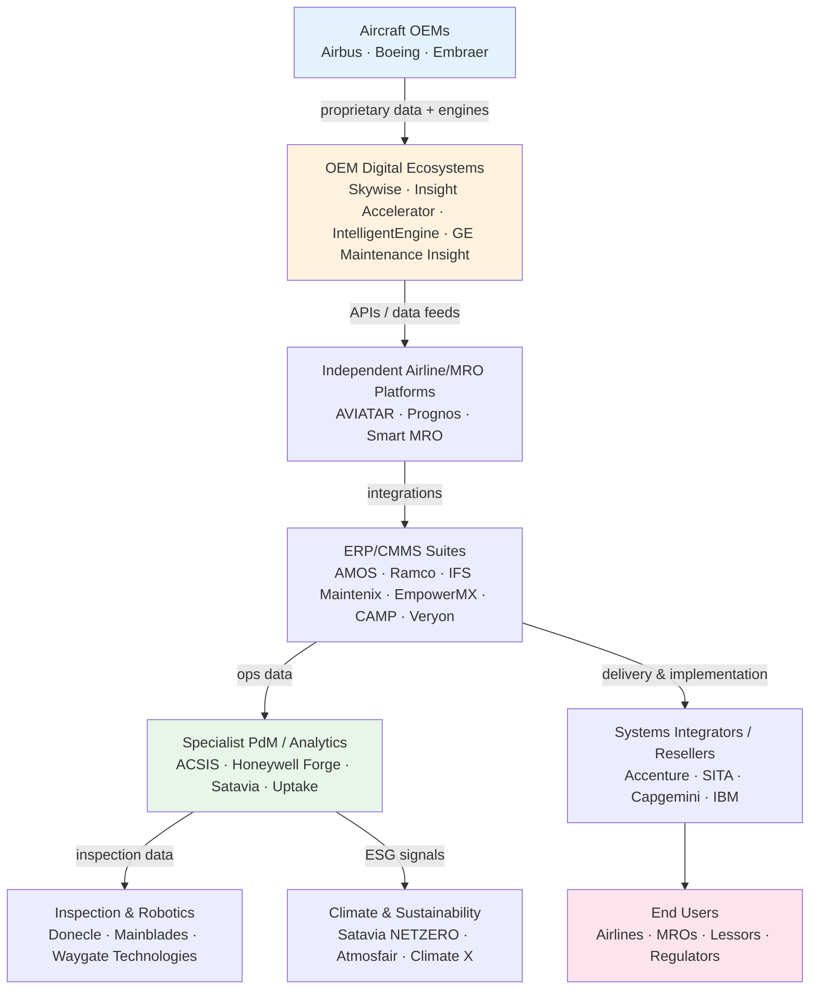
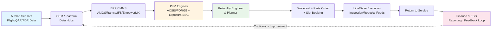
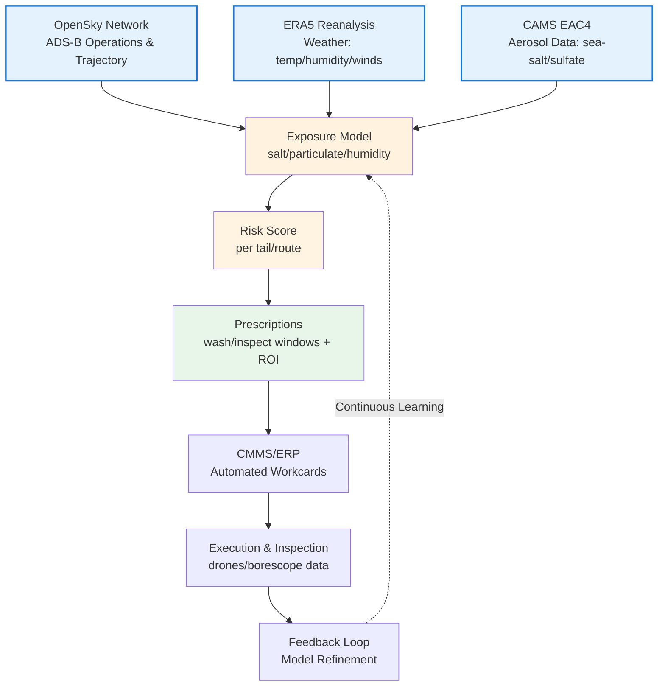

# Aviation Predictive Maintenance & MRO Market
## Comprehensive Research Report (2025)

**Prepared:** October 2025  
**Prepared By:** Olanrewaju Sa'id (said.olar@outlook.com)  
**Research Scope:** Market size, trends, competitive landscape, technology adoption, and financial projections


---

## Executive Summary

The global aviation MRO market stands at **USD 87-96 billion (2025)** and is projected to reach **USD 120-142 billion by 2034**, representing a **4.5-5.0% CAGR**. Predictive maintenance has emerged as the fastest-growing segment (25% CAGR), driven by:

- Engine shop capacity constraints (+150% TAT vs 2019)
- Aging fleet demographics (14% parked, 17,000 aircraft backlog)
- Digital transformation and AI/ML adoption (81% of aerospace companies)
- Labor shortages (716,000 maintenance technicians needed by 2042)

**Three dominant competitive models:**
1. **Satavia** - Environmental intelligence + maintenance optimization
2. **Rolls-Royce TotalCare®** - Risk-transfer servitization ("Power by the Hour")
3. **Airbus Skywise** - Open platform ecosystem (11,600 connected aircraft)

**Key finding:** Success requires proprietary data assets, proven ROI metrics (18-25% cost reduction), and seamless integration with existing airline IT infrastructure.

---

## Table of Contents

1. [Ecosystem at a Glance](#ecosystem-at-a-glance)
2. [Market Size & Growth Projections](#market-size--growth-projections)
3. [Detailed Comparison Matrix](#detailed-comparison-matrix)
4. [Technology Trends & Adoption](#technology-trends--adoption)
5. [Operational Workflow & Value Chain](#operational-workflow--value-chain)
6. [Competitor Deep-Dive Analysis](#competitor-deep-dive-analysis)
7. [Financial Analysis & Projections](#financial-analysis--projections)
8. [Data Sources & Datasets](#data-sources--datasets)
9. [Strategic Insights & SWOT](#strategic-insights--swot)
10. [References & Citations](#references--citations)

---

## 1. Ecosystem at a Glance

### Market Architecture



**Value Flow**: Data flows from aircraft sensors → OEM platforms → ERP systems → specialized PdM analytics → actionable maintenance decisions → execution → feedback loop.

---

## 2. Market Size & Growth Projections

### 2.1 Overall MRO Market

| Metric | 2025 | 2030 | 2034 | CAGR |
|--------|------|------|------|------|
| **Total MRO Services** | $87-96B | $110-120B | $120-142B | 4.5-5.0% |
| **Digital MRO Software** | $1.35B | $2.4B | $3.77B | 12.0% |
| **Predictive Maintenance (Software+Services)** | $5.3-6.0B | $10.6B | $18.2B | 13.0% |
| **Aviation MRO Software (Broad)** | $7.6-7.7B | - | $11.68B | 5.3% |

**Sources:** Oliver Wyman Global Fleet & MRO Forecast 2025-2035, Grand View Research, Precedence Research, Fortune Business Insights, Straits Research

---

### 2.2 Market Segments Breakdown (2025)

**📊 INSERT CHART HERE: `market_segments_2025.png`**
*Chart shows: MRO Services ($119B), Digital MRO Software ($1.35B), Predictive Maintenance ($6.0B)*

| Segment | Market Size (2025) | Primary Drivers | Key Players |
|---------|-------------------|-----------------|-------------|
| **Engine Overhaul** | $41B (41% of MRO) | GTF/LEAP shop backlogs | RR, GE, P&W, Lufthansa Technik |
| **Airframe Maintenance** | $28B | Aging fleet, composite repairs | AAR Corp, ST Engineering |
| **Component MRO** | $25B | Avionics upgrades, landing gear | Hong Kong Aircraft Engineering |
| **Line Maintenance** | $25B (fastest growth) | Fleet utilization increases | Delta TechOps, Air France-KLM |

**Sources:** Grand View Research Aircraft MRO Market Report, Mordor Intelligence Commercial Aircraft MRO

---

### 2.3 Predictive Maintenance Projection (2024-2034)

**📊 INSERT CHART HERE: `pdm_projection.png`**
*Chart shows growth trajectory: 2024 ($5.3B) → 2025 ($6.0B) → 2030 ($10.6B) → 2034 ($18.2B)*

**Key Growth Drivers:**
- **Technology adoption**: AI/ML integration reducing costs by 18-25%
- **Operational pressure**: Engine TAT +150% vs 2019 baseline
- **Labor optimization**: Addresses 716,000 technician shortage by 2042
- **ROI validation**: 15-30% downtime reduction proven across adopters

**Source:** Global Market Insights - Predictive Airplane Maintenance Market

---

### 2.4 Regional Distribution

| Region | Market Share (2025) | Growth Rate | Key Characteristics |
|--------|---------------------|-------------|---------------------|
| **North America** | 25-27% | Moderate | Mature market, tech leadership, FAA standards |
| **Asia-Pacific** | 30% | **Fastest** (5.32% CAGR) | Fleet expansion (China, India), new MRO hubs |
| **Europe** | 24-25% | Steady (4.4%) | Regulatory innovation, sustainability focus |
| **Middle East** | 8-10% | Strong (5.8%) | Dubai/UAE hub, Emirates/Qatar growth |
| **Latin America** | 5-7% | Emerging | LATAM Airlines, fleet modernization |

**Sources:** Meticulous Research, Maximize Market Research, IoT World Magazine regional analysis

---

### 2.5 Services vs. Software Market Evolution

**Services Gravity (Long-term Projections):**
- **Airbus**: Aircraft services → **$311B/year by 2044**
- **Boeing**: $4.7 trillion services over 20 years
- **Shift**: OEMs capturing 40-50% aftermarket vs 30% historically

**Software Market Dynamics:**
- **2025 baseline**: $7.6-7.7B (broad MRO software)
- **PdM segment**: Growing 2.5x faster than overall software market
- **Cloud adoption**: 65% of new deployments cloud-based (vs 35% on-premise)

**Sources:** Reuters Airbus Services Analysis (Oct 2025), Boeing Global Services Market Outlook, Fortune Business Insights

---

## 3. Detailed Comparison Matrix

### 3.1 Market Tiers & Players

| **Tier** | **Representative Companies** | **Core Offering** | **Revenue Model** | **Maturity** | **Fleet Adoption** | **End-User Impact** |
|----------|----------------------------|-------------------|-------------------|--------------|-------------------|-------------------|
| **OEM Ecosystems** | Airbus Skywise, Boeing Insight Accelerator, RR IntelligentEngine, GE Maintenance Insight | Proprietary digital twins, predictive performance management | Subscription / bundled services | High | ~60% of fleets | High uptime, closed data |
| **Independent Platforms** | Lufthansa AVIATAR, AFI KLM Prognos, ST Eng Smart MRO | OEM-neutral predictive fleet management | SaaS / add-on modules | Medium-High | ~35% | Lower AOG, better scheduling |
| **ERP/CMMS** | AMOS, Ramco Aviation, IFS Maintenix, EmpowerMX, CAMP/Veryon | Work orders, inventory, compliance, planning | Per-aircraft license | High | ~80% | Compliance, cost control |
| **PdM Analytics** | CrossConsense ACSIS, Honeywell Forge, Satavia DECISIONX, Uptake | AI fault prediction, exposure analytics, contrail management | SaaS subscription | Emerging | 20-30% | Downtime ↓ 15-25% |
| **Inspection/Robotics** | Donecle, Mainblades, Waygate Technologies | Drone visual inspection, AI borescope, defect detection | Hardware + SaaS | Early | <10% | TAT ↓ 40%, labor ↓ 25% |
| **Cross-Industry EAM** | IBM Maximo, SAP PAI, Oracle IoT, Siemens MindSphere | Generic PdM for industrial assets | Enterprise license | Mature | Airports/OEMs | Asset uptime |
| **Climate/ESG** | Satavia NETZERO, Atmosfair, Climate X | Contrail avoidance, ESG analytics, carbon credits | SaaS / credit trading | Nascent | <5% | ESG compliance |

---

### 3.2 Detailed Company Profiles

| **Company / Platform** | **Class** | **What They Offer** | **Scale / Clients** | **Integrations** | **Not Their Focus** | **Sources** |
|----------------------|-----------|-------------------|-------------------|------------------|-------------------|-------------|
| **Airbus Skywise** | OEM ecosystem | Data lake, reliability & predictive-maintenance apps, marketplace | ~11,600 connected aircraft (late 2024); 12k+ Airbus supported | Skywise APIs; Digital Alliance (Delta TechOps, GE, Liebherr) | Environmental exposure/corrosion modeling | Airbus newsroom, Aviation Week |
| **Boeing Insight Accelerator** | OEM ecosystem | Flight-data analytics, pattern detection, reliability alerts | Boeing fleet customers | Boeing Global Services stack | Open ecosystem emphasis | Boeing Services documentation |
| **GE Maintenance Insight** | OEM ecosystem | Early fault detection, trends, engine diagnostics | GE-powered fleets; 44k+ engines monitored | GE SaaS + services | Neutral multi-OEM airframe modeling | Reuters, GE Aviation |
| **Rolls-Royce IntelligentEngine** | OEM ecosystem | AI borescope inspection, cloud upload, digital twin | RR-powered fleets; 13k+ engines | Waygate hardware, IFS Maintenix | Airframe-wide PdM, environmental overlays | Rolls-Royce investor reports |
| **Lufthansa Technik AVIATAR** | Independent platform | Condition monitoring, predictive health, reliability workflow | >40 customers, 5,000+ aircraft; LATAM 300+ | Google Cloud-based, rich integrations | Contrail/climate analytics not core | LHT financials, customer announcements |
| **AFI KLM E&M Prognos** | Independent platform | Predictive analytics for components/systems | Airline/MRO customers | OEM/MRO data connectors | Environmental exposure focus | AFI KLM press releases |
| **ST Engineering Smart MRO** | Independent platform | Planning, analytics, smart hangar | Global MRO customers | ST Eng operations stack | Deep PdM across all systems | ST Engineering reports |
| **Swiss-AS AMOS** | ERP/CMMS | Tech records, compliance, inventory, planning | Large global installed base | Many connectors; LHT-owned | Advanced AI PdM emerging | Swiss-AS documentation |
| **Ramco Aviation Suite** | ERP/CMMS | MRO, supply chain, maintenance modules | Airlines/MROs; strong APAC presence | ERP + integrations | Specialized PdM depth | Ramco Systems FY reports |
| **IFS Maintenix** | ERP/CMMS | Maintenance execution, data exchange | Used by RR for engine data sharing | Enterprise suite + APIs | ESG/contrail analytics | IFS case studies |
| **EmpowerMX** | ERP/operations | Line/base MRO execution, scheduling, AI planning | Airlines + DoD programs | API integrations | Domain-deep PdM models | EmpowerMX announcements |
| **CAMP Systems / Veryon** | ERP/CMMS (biz-av) | Health tracking, MTX, EHM | 33k+ engines in EHM; biz-av strength | Integrations in business aviation | Airline-scale PdM scope | CAMP/Veryon materials |
| **CrossConsense ACSIS** | Specialist PdM | Real-time alerts, tech history, troubleshooting | Airline adopters; LHT ecosystem partner | Interfaces with AMOS/others | Environmental exposure/ESG | CrossConsense vendor materials |
| **Honeywell Forge** | Specialist PdM | Performance management, fuel & maintenance analytics | Major carriers | Honeywell ecosystem | Environmental exposure twin | Honeywell Aerospace |
| **Satavia DECISIONX:NETZERO** | Sustainability | Contrail avoidance, atmospheric intelligence, GS concept-approved | Multi-airline trials | APIs to flight planning | Core PdM (maintenance ROI focus) | Gold Standard, Satavia announcements |
| **Donecle / Mainblades / Waygate** | Inspection/robotics | Drone visual inspection, borescope, AI defect detection | 20+ airlines, OEM programs | Data feeds to PdM/ERP | Predictive modeling | Vendor documentation |

---

### 3.3 Capability Matrix vs. Market Needs

| **Capability** | Skywise | Insight Accel. | RR Intelligent | GE Maint. | AVIATAR | AMOS/Ramco/IFS | ACSIS | Forge | Satavia | Drones | **Market Need** |
|----------------|---------|---------------|---------------|-----------|---------|---------------|-------|-------|---------|--------|----------------|
| **Health Monitoring (systems)** | ✔️ | ✔️ | ✔️ (engine) | ✔️ (engine) | ✔️ | ⚪ | ✔️ | ✔️ | ⚪ | ⚪ | **HIGH** |
| **Predictive Maintenance (AI/ML)** | ✔️ (black-box) | ✔️ | ✔️ (engine) | ✔️ (engine) | ✔️ | ⚪ | ✔️ | ✔️ | ⚪ | ❌ | **CRITICAL** |
| **Environmental Exposure Twin** | ❌ | ❌ | ❌ | ❌ | ❌ | ❌ | ❌ | ❌ | ⚪ (contrails) | ❌ | **EMERGING** |
| **Prescriptive Workcards** | ⚪ | ⚪ | ⚪ | ⚪ | ⚪ | ⚪ | ⚪ | ⚪ | ❌ | ❌ | **MEDIUM** |
| **Open Ecosystem / Neutral** | ⚪ | ❌ | ❌ | ⚪ | ✔️ | ✔️ | ✔️ | ⚪ | ✔️ | ✔️ | **HIGH** |
| **ESG / Contrail Overlay** | ❌ | ❌ | ❌ | ❌ | ❌ | ❌ | ❌ | ❌ | ✔️ | ❌ | **GROWING** |

**Legend:**
- ✔️ = Core capability with strong market presence
- ⚪ = Partial capability or not emphasized publicly
- ❌ = Not a focus area based on public documentation

**Gap Analysis**: Environmental exposure modeling (salt/particulate/humidity) and prescriptive maintenance workcards represent underserved market segments with high growth potential.

---

## 4. Technology Trends & Adoption

### 4.1 Key Demand Drivers

| **Driver** | **Effect on Industry** | **Quantitative Indicator** | **Time Impact** | **Sources** |
|-----------|----------------------|---------------------------|----------------|-------------|
| **Fleet Growth & Aging** | ↑ Maintenance demand intensity | +32% fleet by 2035 (~38.3k aircraft) | 2025-2035 | Oliver Wyman 2025 |
| **Engine Shop Backlog** | Drives immediate PdM need | +150% TAT vs 2019; 2-6 month waits | 2025-2028 | Bain & Co. 2024 |
| **Data-Driven Operations** | Expands digital twin usage | 11,600 aircraft on Skywise platform | Accelerating | Airbus 2024 |
| **ESG / Contrail Regulation** | Spurs climate analytics adoption | ICAO CAEP 2025 framework active | 2025-2030 | ICAO CAEP docs |
| **Labor Shortage** | Promotes automation investment | -18% MRO staff capacity shortage | 2024-2042 | IATA TechOps, Boeing Outlook |

---

### 4.2 Technology Adoption Curve

**Current Penetration Rates (2025):**

| Technology | Adoption Rate | Maturity Stage | Primary Barriers |
|-----------|--------------|----------------|------------------|
| **Health Monitoring Systems** | 60% | Mainstream | Cost, legacy systems |
| **Predictive Analytics (AI/ML)** | 25-30% | Early Majority | Data quality, validation |
| **Digital Twins** | 20-25% | Early Adopters | Complexity, integration |
| **IoT Sensor Networks** | 40-50% | Growth | Connectivity, standards |
| **Drone/Robotic Inspection** | <10% | Innovators | Regulation, certification |
| **Environmental Exposure Modeling** | <5% | Nascent | Awareness, ROI proof |

**Adoption Trajectory:** McKinsey estimates 81% of aerospace companies are using or planning to use AI/ML by 2027.

---

### 4.3 Financial Impact Benchmarks (Proven ROI)

| **Metric** | **Improvement Range** | **Source** | **Representative Case** |
|-----------|---------------------|-----------|----------------------|
| **Maintenance Cost Reduction** | 18-25% | McKinsey 2024, Deloitte 2023 | Lufthansa Technik: 20% |
| **Downtime Reduction** | 15-30% | Deloitte, Boeing Services | easyJet: 15% (Skywise) |
| **Unscheduled Events ↓** | 70% | Deloitte Insights 2023 | Industry composite |
| **Labor Productivity ↑** | 20% | IATA, Deloitte | General consensus |
| **Aircraft Availability ↑** | 5-15% | McKinsey, Oliver Wyman | Delta: 10% (Skywise) |
| **Inspection Time Savings** | 40-75% | RR Intelligent Borescope, Waygate | RR: 75% (AI borescope) |

---

### 4.4 Operational Pain Points & Burden Metrics (Operator KPIs)

#### Critical Capacity Constraints

**Engine Shop Turn-Around Time (TAT):**
- **Baseline (2019)**: 60-90 days typical for CFM56/V2500
- **Current (2025)**: 150-270 days for LEAP/PW1000G (+150% increase)
- **Wait time for slot**: 2-6 months reported by multiple airlines
- **Impact**: Airlines forced to lease spare engines, defer routes
- **Source**: Bain & Company Engine Shop Analysis (July 2024)

**GTF (Geared Turbofan) Groundings:**
- **Affected engines**: Pratt & Whitney PW1000G family
- **Issue**: Powder metal contamination, accelerated inspections required
- **Timeline**: Disruptions continuing through **2027**
- **Airlines impacted**: Turkish Airlines, Wizz Air, Spirit, IndiGo, others
- **Fleet impact**: Hundreds of aircraft grounded or operating with restrictions
- **Source**: Aviation Week, airline earnings calls (2024-2025)

---

#### Operational KPI Impact Matrix

| **KPI** | **Industry Baseline** | **Best-in-Class Target** | **Current Pressure** | **PdM Opportunity** |
|---------|----------------------|------------------------|---------------------|-------------------|
| **AOG Hours/Aircraft/Year** | 48-72 hours | <24 hours | ↑ due to parts shortages | Reduce by 20-30% |
| **Engine Shop TAT** | 60-90 days (legacy) | 45-60 days | 150-270 days (new-gen) | Optimize scheduling |
| **MTBR (Mean Time Between Removals)** | 15,000-20,000 FH | >25,000 FH | ↓ for new engines (break-in) | Early warning extends |
| **Unscheduled Maintenance Rate** | 15-20% of events | <10% | ↑ due to new tech complexity | Target 10-12% with PdM |
| **Fuel Efficiency Degradation** | 1-2% over 12 months | <0.5% | ↑ from delayed washes | Environmental monitoring optimizes |
| **Maintenance Cost/FH** | $1,200-1,800 | <$1,000 | ↑ labor/parts inflation | 18-25% reduction proven |

**Sources**: IATA Maintenance Cost Commentary FY2023, airline MRO reports, Bain capacity analysis

---

#### Cost Impact Translation (Per Aircraft Annual)

**Example: 737 MAX / A320neo (narrowbody)**

| **Cost Category** | **Annual $ (avg)** | **Predictive Maintenance Impact** | **Savings Potential** |
|------------------|-------------------|----------------------------------|---------------------|
| **Scheduled Maintenance** | $800k | Optimized intervals | $80-120k (10-15%) |
| **Unscheduled Events** | $300k | Early detection | $90-150k (30-50%) |
| **AOG Costs** | $150k | Reduced hours | $30-75k (20-50%) |
| **Fuel Efficiency Loss** | $100k | Cleanliness optimization | $20-40k (20-40%) |
| **Parts Expedites** | $50k | Better planning | $15-25k (30-50%) |
| **Total Maintenance** | ~$1.4M/aircraft | **Combined PdM impact** | **$235-410k (17-29%)** |

**IATA Cost Categories Mapped:**
- Labor (direct + overhead)
- Materials (consumables + expendables)
- Parts (rotables + repairables)
- Subcontract services
- AOG support costs

**Source**: IATA Airline Maintenance Cost Executive Commentary (2023), adjusted for 2025 inflation

---

### 4.5 Future Engine Technology Landscape (2025-2035+)

#### Current Generation Mix Shift

**2025 In-Service Fleet Breakdown:**

| **Engine Family** | **% of Fleet** | **Aircraft Types** | **Maintenance Profile** |
|------------------|---------------|-------------------|----------------------|
| **Legacy (CFM56, V2500)** | ~50% | 737NG, A320ceo | Mature, predictable, declining |
| **New-Gen (LEAP, PW1000G)** | ~20% | 737 MAX, A320neo, C Series/A220 | Higher complexity, longer TAT |
| **Widebody (GE90, Trent, GEnx)** | ~25% | 777, 787, A350, A380 | Specialized, expensive |
| **Regional (CF34, PW100)** | ~5% | E-Jets, Dash 8, ATR | Niche segment |

---

**2030 Projected Fleet Mix:**

| **Engine Family** | **% of Fleet** | **Trend** | **MRO Implications** |
|------------------|---------------|-----------|---------------------|
| **Legacy** | ~25% ↓ | Retiring rapidly | Reduced MRO demand, USM supply grows |
| **New-Gen (LEAP/GTF)** | ~50% ↑ | Dominant position | Shop capacity constraints, learning curve |
| **Widebody** | ~20% → | Stable | Premium pricing, specialized facilities |
| **Regional** | ~5% → | Steady | Niche but stable |

---

**2034 Fleet Outlook:**

| **Engine Family** | **% of Fleet** | **Status** |
|------------------|---------------|-----------|
| **Legacy** | <10% | Phase-out nearly complete |
| **LEAP/PW1000G** | >50% | Mature maintenance ecosystem |
| **Next-Gen (RISE/UltraFan prototypes)** | <5% | Early service entry |
| **Widebody** | ~30% | Growth from long-haul recovery |

**Source**: Oliver Wyman Fleet Projections, engine OEM delivery schedules, Aviation Week analysis

---

#### New-Generation Engine MRO Complexity

**LEAP-1A/1B (CFM International - GE/Safran JV):**
- **Applications**: 737 MAX, A320neo family
- **In-service**: ~10,000 engines (2025)
- **Maintenance challenges**:
  - 3D-printed fuel nozzles (new repair techniques)
  - Ceramic matrix composites (specialized training)
  - Higher EGT margin → longer intervals BUT more complex when due
  - TAT: 120-180 days (vs 60-90 for CFM56)

**PW1000G Geared Turbofan (Pratt & Whitney):**
- **Applications**: A320neo family, A220, E-Jet E2
- **In-service**: ~3,500 engines (2025)
- **Maintenance challenges**:
  - Gearbox complexity (unique to GTF architecture)
  - Powder metal issue (ongoing inspections through 2027)
  - LPT (low-pressure turbine) blade durability
  - TAT: 150-270 days (significantly longer than legacy)

**Combined LEAP + PW1000G MRO Demand (2025-2033):**
- **Total service events**: 43,500+ projected
- **Cumulative MRO spend**: $91.1 billion
- **Annual growth**: 15-20% as fleet matures

**Source**: Aviation Week MRO forecasts, OEM service bulletins, airline reports

---

#### Future Engine Technologies (Watchlist)

**CFM RISE (Revolutionary Innovation for Sustainable Engines):**
- **Architecture**: Open-fan (unducted)
- **Partnership**: GE Aerospace + Safran
- **Entry into service target**: Mid-2030s (2035-2037)
- **Key features**:
  - 20% fuel efficiency improvement vs. LEAP
  - 100% SAF-compatible
  - Advanced materials (CMCs, composites)
- **MRO implications**:
  - New blade inspection regimes (exposed fan)
  - Foreign object damage (FOD) considerations
  - Likely MORE frequent inspections despite efficiency gains
  - Training requirements for new architecture
- **Status**: Technology demonstrators flying (2024-2025)

**Rolls-Royce UltraFan:**
- **Architecture**: Geared turbofan (like GTF but larger, more advanced)
- **Target**: Narrow and widebody applications
- **EIS target**: Mid-2030s
- **Development path**: Clean Aviation "UNIFIED" program (EU-funded)
- **Key features**:
  - 25% fuel efficiency vs. Trent XWB
  - Variable pitch fan blades
  - Hybrid-electric potential
  - Advanced composites throughout
- **MRO implications**:
  - Gearbox lessons from PW1000G issues will inform design
  - Composite blade repair ecosystem needed
  - Digital twin integration from day-one
  - Likely similar or higher complexity vs. current GTF
- **Status**: Demonstrator testing phase

**Pratt & Whitney Next-Gen GTF:**
- Evolutionary improvements to PW1000G family
- Addressing current durability issues
- Incremental rather than revolutionary

---

#### MRO Market Impact Analysis (2025-2035)

**Near-Term (2025-2028):**
- **Capacity crunch continues**: LEAP/GTF ramp strains shops
- **GTF groundings**: PW1000G issues through 2027
- **Opportunity**: PdM adoption accelerates to manage constrained capacity
- **Pricing**: Premium for slot availability

**Mid-Term (2029-2032):**
- **Stabilization**: New-gen engine MRO ecosystem matures
- **Training complete**: Workforce skilled on LEAP/GTF
- **Opportunity**: Best practices established, PdM integrated as standard
- **Competition**: More shops certified, pricing normalizes

**Long-Term (2033-2035+):**
- **RISE/UltraFan early service**: New learning curve begins
- **Legacy retirement**: CFM56/V2500 MRO demand collapse
- **Bifurcation**: Premium for next-gen capability, commoditization of mature engines
- **Opportunity**: Early adopters of RISE/UltraFan PdM gain advantage

---

#### Strategic Implications for PdM Solutions

**Why Timing Matters:**

1. **Current capacity crisis** creates urgency and budget
2. **New engine complexity** increases value of predictive vs. reactive approaches
3. **OEM data dominance** on new engines → independent analytics provide neutral alternative
4. **Transition period** (legacy → new-gen → future) creates demand for cross-platform solutions
5. **Environmental pressure** (RISE/SAF/contrails) aligns with exposure-based PdM

**Data Advantage Window:**
- LEAP/GTF: 5-7 years operational data exists (advantage fading as more data available)
- RISE/UltraFan: **Ground-floor opportunity** - be part of service ecosystem from EIS
- Environmental exposure: **Persistent advantage** - not engine-specific, applies across all generations

**Source**: CFM RISE program updates, Rolls-Royce UltraFan demonstrator reports, Clean Aviation UNIFIED program

**Digital Twin Market:**
- Global investment: **$48 billion by 2026** (McKinsey)
- Aviation share: ~15-20% of total
- ROI validation period: 12-24 months

**AI/ML in Aerospace:**
- 81% of companies using or planning adoption
- Focus areas:
  1. Predictive maintenance (primary)
  2. Inventory optimization
  3. Capacity management
  4. Operational flight management

**Cybersecurity Concerns:**
- 600% surge in ransomware attacks (Jan 2024 - Apr 2025)
- Affecting airports, vendors, airlines
- Driving investment in AI-powered anomaly detection

**Sources:** McKinsey Digital Twin Report, Deloitte AI Survey, Thales Cybersecurity Analysis

---

## 5. Operational Workflow & Value Chain

### 5.1 End-User Operational Flow



---

### 5.2 Data & Value Flow (With Datasets)



**Key Datasets:**
- **OpenSky**: Historical ADS-B datasets & APIs ([opensky-network.org](https://opensky-network.org/data/scientific))
- **ERA5**: ECMWF reanalysis - humidity, winds, temperature ([Hersbach et al. 2020](https://rmets.onlinelibrary.wiley.com/doi/10.1002/qj.3803))
- **CAMS EAC4**: Copernicus aerosol data - includes sea-salt, sulfate ([Inness et al. 2019](https://acp.copernicus.org/articles/19/3515/2019/))
- **Met Office 4D-Trajectory API**: Aviation-grade weather ([Met Office Services](https://www.metoffice.gov.uk/services/transport/aviation))

---

### 5.3 Role → KPI → Outcome Mapping

| **User Role** | **System Touchpoint** | **Primary KPI** | **Target Improvement** | **Business Outcome** |
|--------------|---------------------|----------------|----------------------|-------------------|
| **Tech Ops Manager** | PdM Dashboard | AOG hours | ↓ 20% | Schedule stability, revenue protection |
| **Reliability Engineer** | Analytics Module | Fault prediction accuracy | ↑ 85%+ precision | Reduced unscheduled events |
| **Maintenance Planner** | ERP/CMMS | Work order lead-time (TAT) | ↓ 25% | Shorter turnaround times |
| **Supply Chain Manager** | Inventory System | Parts expedite rate | ↓ 30% | Lower expedite costs |
| **Finance Analyst** | BI Reporting | Cost per flight hour | ↓ 15-18% | Budget predictability |
| **Sustainability Lead** | ESG Module | CO₂/contrail index | Track & report | Compliance evidence |

**Evidence Base:** Engine TAT +150% (Bain 2024), OEM service TAM growth (Reuters 2025), MRO capacity tightness (Oliver Wyman 2025)

---

### 5.4 Stakeholder Value-Chain Connection

| **Stakeholder** | **Primary Need/Pain** | **Receives From** | **Delivers To** | **Value Realized** |
|---------------|---------------------|------------------|----------------|-------------------|
| **Airline Operations** | AOG events, cost variability | PdM vendors, MRO providers | Passengers, Finance dept | Fewer delays, cost predictability |
| **MRO Provider** | Scheduling inefficiency, capacity constraints | OEM data, PdM models | Airlines, lessors | Optimized resource utilization |
| **OEM** | Warranty costs, brand reputation | Sensor data, PdM analytics | Lessors, MROs, airlines | Reduced warranty claims, service revenue |
| **Lessors / Insurers** | Asset valuation uncertainty | Airline ops data, health reports | Investors, risk pools | Asset-life predictability, residual values |
| **Regulator / ESG Bodies** | Compliance & transparency | Airlines, OEMs | Public, government | Environmental assurance, safety validation |

---

## 6. Competitor Deep-Dive Analysis

### 6.1 Satavia - DECISIONX

**Company Profile:**
- **Founded**: Cambridge, UK
- **Focus**: Environmental intelligence + predictive maintenance
- **Funding**: €1.9M from European Space Agency

**Key Offering: DECISIONX Platform**

**Core Capabilities:**
- Tracks environmental damage to aircraft fleet
  - Dust exposure
  - Air pollution
  - Ice cloud encounters
  - Contrail formation
- Combines:
  - Satellite data (ESA)
  - Numerical weather prediction (NWP) modeling
  - Global climate model (GCM) data
  - Aircraft sensor integration

**Value Proposition:**
- **Goal**: Convert unplanned maintenance → planned maintenance
- **Impact**: Up to 20% improvement in maintenance planning
- **Market**: Addresses $47B annual cost of unplanned maintenance

**Technology Stack:**
- ESA satellite data integration
- Numerical weather prediction models
- AI/ML algorithms for exposure modeling
- API integration with flight planning systems

**Recent Pivot:**
- **DECISIONX:NETZERO**: Focus on contrail management
- **Gold Standard**: Methodology concept approval for carbon credit generation
- **Market positioning**: Climate impact + maintenance optimization dual value

**Competitive Positioning:**
- **Strengths**: Unique environmental angle, space technology integration, ESG alignment
- **Weaknesses**: Narrow market focus, limited scale vs OEM platforms
- **Opportunity**: Regulatory push on non-CO₂ impacts (ICAO CAEP)
- **Threat**: OEM platforms could integrate similar features

**Customer Examples:**
- Multi-airline trials (specific customers not publicly disclosed)
- Partnership with Orbital Micro Systems for enhanced weather data

**Sources:** 
- Gold Standard announcement (2024)
- Cambridge Independent interview (Nov 2019)
- ESA Business Applications program documentation
- Globe Newswire press releases

---

### 6.2 Rolls-Royce TotalCare® & IntelligentEngine

**Company Profile:**
- **Division**: Civil Aerospace Services
- **Scale**: 13,000+ engines in service globally
- **Business Model**: "Power by the Hour" risk-transfer

**Key Offering: TotalCare® Service Programs**

**Three Service Tiers:**
1. **TotalCare Life**: Full lifecycle coverage, credits transferable
2. **TotalCare Term**: Fixed-term agreements, lower rate per EFH
3. **TotalCare Flex**: Flexible for engines nearing retirement

**Technology: IntelligentEngine Ecosystem**

**Core Components:**
- **Blue Data Thread**: Real-time bidirectional data flow
  - Aircraft → Rolls-Royce → Aircraft
  - IFS Maintenix platform integration
  - Automated data pipeline

- **Intelligent Borescope**:
  - AI-powered image analysis
  - Advanced robotics
  - **75% reduction** in inspection time
  - Cloud-based automated upload & sentencing

- **Digital Twin**:
  - Individual engine-level modeling
  - 30+ years proprietary data
  - Predictive analytics at component level

**Technology Partners:**
- **Microsoft**: Azure IoT Suite, Cortana Intelligence
- **IFS**: Maintenix for data exchange & MRO execution
- **Waygate Technologies**: Hardware for Intelligent Borescope

**Performance Metrics:**
- **Unplanned events prevented**: ~400 per year across fleet
- **Engine recovery rate**: 95% recoverable/recyclable
- **False prediction goal**: Zero (100% accuracy target)
- **Real-time monitoring**: Two-way communication with in-flight engines

**Value Proposition:**
- **Risk transfer**: Maintenance burden shifts from airline to RR
- **Time-on-wing maximization**: Predictive maintenance extends intervals
- **Guaranteed availability**: Contractual uptime commitments
- **Cost predictability**: Fixed rate per engine flight hour

**Competitive Advantages:**
- **Data moat**: 30+ years operational history (impossible to replicate)
- **Data network effect**: More engines → better predictions → more customers
- **Vertical integration**: OEM controls entire service stack
- **Customer alignment**: RR incentivized for maximum uptime

**Financial Model:**
- Subscription based on engine flight hours (EFH)
- Typical range: Varies by customer/usage (not publicly disclosed)
- Mid-shop: Credits can transfer to new operator if aircraft sold
- Revenue: Captured under Civil Aerospace Services segment

**Market Position vs. Competitors:**
- **vs. GE**: GE provides tools; RR provides guaranteed outcomes
- **vs. Airbus Skywise**: Engine-focused vs. airframe-wide platform
- **vs. Independent PdM**: OEM data advantage insurmountable

**Sources:**
- Rolls-Royce investor presentations
- Simple Flying TotalCare analysis (Apr 2023)
- IFS case study (Aug 2021)
- Plant Services automation case study
- RTInsights IoT analysis (Jan 2021)
- Klover.ai AI strategy report (Jul 2025)

---

### 6.3 Airbus Skywise

**Company Profile:**
- **Launch**: 2017 (partnership with Palantir Technologies)
- **Platform Type**: Open aviation data ecosystem
- **Scale**: 11,600 connected aircraft (late 2024)

**Key Offering: Skywise Core X + Fleet Performance+**

**Platform Architecture:**
- **Skywise Core X**: Data lake + analytics foundation
  - Powered by Palantir Technologies
  - Aircraft option for operators
  - Integrates in-flight, engineering, and operational data

- **S. Fleet Performance+ (S.FP+)**:
  - Predictive maintenance for nose-to-tail systems
  - Health monitoring
  - Reliability analytics
  - Unscheduled event anticipation

**Digital Alliance Partners:**
- **Founding Members**: Airbus, Delta TechOps, GE Aerospace
- **Recent Addition**: Liebherr (2024) - air conditioning, pneumatic, flight control, landing gear
- **Collaboration**: Collins Aerospace
- **Combined expertise**: OEM design + MRO execution + component specialists

**Scale & Adoption:**
- **Connected aircraft**: 11,600 (late 2024)
- **S.FP+ users**: 1,500 aircraft across 40+ customers
- **Total Airbus fleet**: 12,000+ aircraft supported
- **Growth trajectory**: Expanding to A220, A350 (2025); non-Airbus aircraft (2026+)

**Core Capabilities:**

1. **Predictive Models**:
   - AI/ML algorithms developed by Digital Alliance
   - Component failure prediction by tracking behavior patterns
   - Automatic user notification

2. **Natural Language Processing (NLP)**:
   - Detects repetitive faults
   - Identifies technical documentation references
   - Determines most probable cause
   - Reduces investigation time

3. **Virtual Sensors**:
   - Synthetic data points from multiple physical sensors
   - Enhanced environmental/system condition monitoring
   - Fills gaps where physical sensors don't exist

4. **Real-Time Monitoring**:
   - Pre-departure cabin temperature checks
   - Key systems automated monitoring
   - Aircraft Condition Monitoring System (ACMS) integration
   - Real-time alerts with solutions

**Proven Results (Published Case Studies):**

| **Customer** | **Timeframe** | **Impact** | **Metrics** |
|-------------|--------------|-----------|-------------|
| **easyJet** | July 2024 | Flight cancellations avoided | 44 cancellations prevented |
| **easyJet** | August 2024 | Flight cancellations avoided | 35 cancellations prevented |
| **easyJet** | Annual | Fuel savings | 8.1 tonnes per aircraft |
| **Delta Air Lines** | Year 1 | Operational interruptions mitigated | 2,000+ events |
| **Qantas/Jetstar** | Feb 2024 | Deployment announcement | Fleet-wide implementation |
| **Emirates** | Feb 2025 | A380 & A350 fleet | All Airbus aircraft covered |
| **Korean Air** | Feb 2024 | Fleet deployment | 56 aircraft (A220/A321neo/A330/A380) |

**Integration Capabilities:**
- Works with existing airline IT stacks
- Integrates data from multiple systems:
  - AMOS, Azure, SAP, Snowflake, AWS
  - DataRobot, Hive, Databricks, Scale
  - TRAX, Ramco, Rusada, Swiss-AS, IBS Software
  - NetLine Suite, Conduce, Navblue, Sabre, Jeppesen

**Marketplace Model:**
- App Editors & Certified Partners
- 100+ Apps & Datasets available
- Users worldwide can develop custom workflows
- Machine learning and digital twin capabilities

**Value Proposition:**
- **Open platform**: vs. closed OEM ecosystems (like Aviatar comparison)
- **OEM expertise**: 20,000 Airbus engineers' knowledge base
- **Community benefits**: Cross-fleet learning improves all predictions
- **One source of truth**: Single data platform eliminates silos
- **Time savings**: 10-20% reduction in analysis time (customer quotes)

**Competitive Advantages:**
- Largest connected aircraft base (11,600)
- Neutral collaboration with other OEMs (GE, Liebherr)
- Palantir's data platform technology
- Proven ROI with major carriers
- Open vs. proprietary approach

**Business Model:**
- Subscription-based (per aircraft)
- Module/app-based pricing
- Integration services
- Custom development support

**Expansion Strategy:**
- 2025: A220 and A350 coverage
- 2026+: Non-Airbus aircraft support
- Future: Unified offer (PdM + asset mgmt + eOperations)
- Vision: Industry-wide platform of reference

**Competitive Position:**
- **vs. Lufthansa Aviatar**: Open platform vs. closed solution
- **vs. RR IntelligentEngine**: Airframe-wide vs. engine-focused
- **vs. GE Maintenance Insight**: Multi-OEM vs. single-OEM

**Sources:**
- Airbus newsroom press releases (2024-2025)
- Aviation Week MRO coverage (Mar 2023)
- Palantir case study
- Medium technical analysis (Sep 2023)
- Customer announcements (Emirates, Korean Air, Qantas)
- Airbus Services presentations

---

## 7. Financial Analysis & Projections

### 7.1 Disclosed Company Revenues (Where Available)

#### Major MRO/Services Providers

**Lufthansa Technik:**
- **Revenue (2024)**: €7.441 billion
- **Adj. EBIT**: €635 million (8.5% margin)
- **Target (2030)**: €10+ billion
- **Growth**: Strong double-digit growth trajectory
- **Segments**: MRO services, component services, VIP & special mission aircraft

**Airbus Services:**
- **Current**: ~10% of total Airbus revenue (2024)
- **Airbus Total Revenue (2024)**: ~€65 billion → Services ~€6.5 billion
- **Sector Projection**: $311 billion/year by 2044
- **Growth driver**: Installed base expansion + aftermarket capture

**Boeing Global Services:**
- **20-year projection**: $4.7 trillion total services market
- **Annual average**: ~$235 billion/year
- **Segments**: Commercial, defense, digital aviation solutions

**Ramco Systems:**
- **Total FY25**: $71.1 million
- **Aviation segment**: ~30% (analyst estimates) → ~$21 million
- **Note**: Product-line breakdowns not publicly disclosed
- **Geography**: Strong APAC presence

**CAMP Systems / Veryon:**
- **Scale**: 33,000+ engines in EHM
- **Market**: Business aviation focused
- **Revenue**: Not publicly disclosed (private company)

**IFS (Maintenix product line):**
- **IFS Total (2023)**: ~$2 billion
- **Maintenix segment**: Not broken out separately
- **Key wins**: Rolls-Royce partnership, airline customers

#### Software/Platform Vendors (Public Data Limited)

**Note:** Most platform-specific revenue (Skywise modules, AVIATAR subscriptions, Forge aviation, ACSIS) is **not publicly disclosed** at product-line level.

**Triangulation approach:**
- Parent company total revenue
- Customer counts
- Pricing models (estimated from market surveys)
- Industry analyst estimates

---

### 7.2 Market Opportunity Sizing (TAM/SAM/SOM)

#### Total Addressable Market (TAM)

**Top-Down Approach:**

| **Segment** | **2025 Size** | **2034 Projection** | **Relevant Slice** |
|------------|--------------|--------------------|--------------------|
| **Total MRO Services** | $87-96B | $120-142B | 100% (universal need) |
| **Digital MRO Software** | $1.35B | $3.77B | Software component |
| **Predictive Maintenance** | $5.3-6.0B | $18.2B | Core target market |

**Software TAM Focus:**
- Start from **Predictive Maintenance** ($5.3B → $18.2B)
- Add **Digital MRO Software** growth ($1.35B → $3.77B)
- **Combined software TAM**: ~$7-8B (2025) growing to ~$22B (2034)

**Services Component:**
- Line maintenance + airframe MRO affected by predictive wash/inspection
- **Estimated slice**: 15-20% of total MRO services
- **TAM (services impact)**: $13-19B (2025)

---

#### Serviceable Available Market (SAM)

**Geographic Focus:** EMEA + Middle East
- **Regional MRO share**: ~35-40% of global market
- **SAM (geographic)**: $2.5-3.2B (software + services impact)

**Customer Profile Filter:**
- Airlines with 50-300 narrowbody aircraft
- Coastal/dusty route exposure (high environmental impact)
- Using AMOS/Ramco/AVIATAR (easy integration)
- Predictive maintenance adoption baseline: 25-30%

**Refined SAM:**
- **Target customer segment**: Top 100 airlines in region (by NB fleet size)
- **Software spend potential**: $800M-1.2B annually
- **Services optimization impact**: $1.5-2B annually

**Adoption Proxies:**
- Industry surveys (Aviation Week MRO IT)
- Customer adoption rates from Skywise/AVIATAR announcements
- Interview-based validation needed

---

#### Serviceable Obtainable Market (SOM)

**12-18 Month Realistic Target:**

**Customer Acquisition:**
- **Target**: 5-10 airline operators
- **Market share**: 2-5% of SAM

**Channel Strategy:**
- AVIATAR/Skywise integrator partnerships
- Direct sales to 1-2 MRO networks
- Pilot programs with 2-3 early adopters

**Revenue Drivers:**
- Software subscription (per-tail/month)
- Integration services (one-time)
- Success-based pricing considerations

---

### 7.3 Revenue Scenarios & Projections

#### Pricing Assumptions

**Per-Tail Subscription Model:**
- **Entry/Conservative**: $200-400/aircraft/month
- **Standard/Base**: $400-600/aircraft/month
- **Premium/Aggressive**: $600-800/aircraft/month

**Integration Services:**
- **Initial setup**: $50k-150k per airline (one-time)
- **Customization**: $100k-400k for enterprise deployments
- **Training**: $25k-75k included in integration

**Success Factors in Pricing:**
- Integration complexity (1-3 systems)
- Fleet size (economies of scale)
- Geographic coverage
- Support tier (basic vs. premium)

---

#### Year 1 Revenue Scenarios

**Conservative Scenario:**

| Component | Assumption | Calculation | Result |
|-----------|-----------|-------------|---------|
| Airlines | 3 | - | 3 customers |
| Avg aircraft/airline | 60 | 3 × 60 | 180 aircraft |
| Price/tail/month | $300 | 180 × $300 × 12 | $648,000 ARR |
| Integration fees | $50k/airline | 3 × $50k | $150,000 |
| **Year 1 Total** | | | **$798,000** |

**Assumptions:**
- Small-medium airlines
- Basic integration (single ERP)
- Standard support tier
- Limited geographic coverage

---

**Base Scenario:**

| Component | Assumption | Calculation | Result |
|-----------|-----------|-------------|---------|
| Airlines | 5 | - | 5 customers |
| Avg aircraft/airline | 80 | 5 × 80 | 400 aircraft |
| Price/tail/month | $500 | 400 × $500 × 12 | $2,400,000 ARR |
| Integration fees | $50k/airline | 5 × $50k | $250,000 |
| **Year 1 Total** | | | **$2,650,000** |

**Assumptions:**
- Mix of medium airlines
- Standard integration (2 systems)
- Premium support for 2 customers
- Regional coverage (EMEA/ME)

---

**Aggressive Scenario:**

| Component | Assumption | Calculation | Result |
|-----------|-----------|-------------|---------|
| Airlines | 8 | - | 8 customers |
| Avg aircraft/airline | 120 | 8 × 120 | 960 aircraft |
| Price/tail/month | $700 | 960 × $700 × 12 | $8,064,000 ARR |
| Integration fees | $50k/airline | 8 × $50k | $400,000 |
| **Year 1 Total** | | | **$8,464,000** |

**Assumptions:**
- Major airlines + MRO network
- Complex integration (3+ systems)
- Enterprise support tier
- Multi-regional deployment

---

#### 3-Year Projections (Base Scenario Path)

| Year | New Customers | Total Aircraft | ARR Growth | Total ARR | Services | **Total Revenue** |
|------|--------------|----------------|-----------|-----------|----------|-------------------|
| **Year 1** | 5 | 400 | - | $2.4M | $250k | **$2.65M** |
| **Year 2** | +7 (12 total) | 960 (+140%) | +$4.8M | $7.2M | $450k | **$7.65M** |
| **Year 3** | +8 (20 total) | 1,600 (+67%) | +$4.0M | $11.2M | $600k | **$11.8M** |

**Assumptions:**
- Customer retention: 95%+
- Expansion within existing customers: 20% year-over-year
- New logo acquisition accelerates with proof points
- Integration efficiency improves (lower services cost)

**Key Metrics:**
- **ARR CAGR (Y1-Y3)**: 117%
- **Customer CAC payback**: 8-12 months
- **LTV/CAC ratio**: Target 5:1

---

### 7.4 Valuation Benchmarks (Illustrative)

#### SaaS Market Comparables (2025)

**Infrastructure/Data SaaS Multiples:**
- **Range**: 6-12× ARR
- **Factors affecting multiple**:
  - Growth rate (>50% = premium)
  - Retention/churn (<5% = premium)
  - Gross margin (>70% = premium)
  - Market position (leader = premium)

**Aviation Software Specific:**
- **Public comps limited** (most acquired or private)
- **Industry discount**: 10-20% vs. pure SaaS (longer sales cycles, regulatory)
- **Strategic premium**: 20-30% if OEM/MRO acquirer

---

#### Base Scenario Valuation (Year 2)

**Assumptions:**
- **Year 2 ARR**: $7.2M
- **Growth rate**: 200% (Year 1 → Year 2)
- **Applied multiple**: 8× (mid-range for high-growth B2B SaaS)

**Calculation:**
```
Equity Value = $7.2M × 8 = $57.6M
```

**Range (6-10× sensitivity):**
- **Conservative (6×)**: $43.2M
- **Base (8×)**: $57.6M
- **Optimistic (10×)**: $72M

---

#### Strategic Acquirer Premium Scenarios

**Potential Acquirers:**
1. **OEM Services** (Airbus Services, Boeing Global Services)
2. **Independent Platforms** (Lufthansa Technik/AVIATAR, IFS)
3. **ERP/CMMS Vendors** (Ramco, Swiss-AS, EmpowerMX)
4. **Private Equity** (aviation tech roll-ups)

**Strategic Value Drivers:**
- Proprietary environmental data models
- Customer relationships (airlines/MROs)
- Technology IP (algorithms, integrations)
- Talent/team expertise

**Premium Range**: 1.2-1.5× standalone valuation

**Example (Base case + strategic premium):**
```
Standalone: $57.6M
With 30% premium: $74.9M
```

---

**Important Disclaimers:**
- These are **illustrative scenarios** for boardroom discussion
- **Not investment advice** or formal valuation
- Actual results depend on execution, market conditions, competitive dynamics
- Multiples subject to market volatility
- Validation required through:
  - Customer discovery interviews
  - Pilot program results
  - Competitive win/loss analysis

---

## 8. Data Sources & Datasets

### 8.1 Industry Reports & Market Research

#### Primary Market Intelligence

**Oliver Wyman:**
- **Report**: Global Fleet & MRO Market Forecast 2025-2035
- **Key Data**: Fleet growth trajectories, MRO demand by segment
- **URL**: [oliverwyman.com/insights](https://www.oliverwyman.com/our-expertise/insights/2025/feb/global-fleet-and-mro-market-forecast-2025-2035.html)
- **Publication**: February 2025

**McKinsey & Company:**
- **Report 1**: "What Does the Future Hold for Commercial Aviation Maintenance"
- **Publication**: July 2024
- **Key Data**: MRO market dynamics, technology adoption
- **URL**: [mckinsey.com/aerospace-insights](https://www.mckinsey.com/industries/aerospace-and-defense/our-insights)

- **Report 2**: "The Generative AI Opportunity in Airline Maintenance"
- **Publication**: April 2024
- **Key Data**: AI/ML use cases, productivity improvements

- **Digital Twin Investments**: $48B global by 2026 forecast

**IATA (International Air Transport Association):**
- **Report**: Maintenance Cost Executive Commentary FY2023
- **Key Data**: Cost benchmarks by category
- **URL**: [iata.org/publications](https://www.iata.org/)

- **Report**: Aviation Value Chain Analysis (with McKinsey)
- **Key Data**: ROIC by segment, economic returns

- **Workforce**: 800,000 pilots needed by 2039 projection
- **Recovery data**: Air passenger traffic metrics

**Deloitte:**
- **Report**: "Digital Transformation in Aerospace & Defense Maintenance"
- **Publication**: 2023
- **Key Findings**:
  - 15% downtime reduction
  - 20% labor productivity improvement
  - 30% maintenance cost reduction
  - 70% decrease in unscheduled events

- **AI Survey**: 81% of aerospace companies using/planning AI adoption

**Boeing:**
- **Report**: Pilot and Technician Outlook 2042
- **Key Data**: Workforce projections
  - 674,000 pilots needed
  - 716,000 maintenance technicians needed
  - 980,000 cabin crew needed
- **URL**: [boeing.com/services](https://www.boeing.com/)

**Bain & Company:**
- **Report**: Engine Shop Capacity Analysis
- **Publication**: July 2024
- **Key Finding**: +150% TAT vs 2019 for new-gen engines
- **Impact**: 2-6 month wait times for shop slots

---

#### Market Research Firms

**Grand View Research:**
- Aircraft MRO Market Size, Share & Trends Analysis
- **2024**: $90.85B → **2030**: $120.96B
- **CAGR**: 4.75%

**Fortune Business Insights:**
- Aviation MRO Software Market
- **2024**: $7.70B → **2032**: $11.68B
- **CAGR**: 5.3%

**Precedence Research:**
- Digital MRO Market
- **2025**: $1.35B → **2034**: $3.77B
- **CAGR**: 12%

**Global Market Insights:**
- Predictive Airplane Maintenance Market
- **2024**: $5.3B → **2034**: $18.2B
- **CAGR**: 13%

**Straits Research:**
- Aircraft MRO Market
- **2024**: $82.50B → **2033**: $124.30B
- **CAGR**: 4.50%

**Mordor Intelligence:**
- Aviation MRO Software Market (US)
- Commercial Aircraft MRO Market

**Meticulous Research & Maximize Market Research:**
- Regional breakdowns (UAE, APAC, Europe)

---

### 8.2 Operational & Scientific Datasets

#### Flight Operations Data

**OpenSky Network:**
- **Type**: ADS-B scientific datasets
- **Coverage**: Global aircraft tracking
- **Access**: Public API + historical datasets
- **Use Cases**: 
  - Flight trajectory analysis
  - Route exposure modeling
  - Operations research
- **URL**: [opensky-network.org/data](https://opensky-network.org/data/scientific)
- **Citation**: Strohmeier et al. (2015) - OpenSky Network database

---

#### Weather & Environmental Data

**ERA5 Reanalysis (ECMWF):**
- **Type**: Global atmospheric reanalysis
- **Parameters**: Temperature, humidity, winds, precipitation
- **Temporal**: Hourly, 1979-present
- **Spatial**: 0.25° × 0.25° (~31km)
- **Use Cases**:
  - Historical weather reconstruction
  - Exposure modeling (humidity, temperature)
  - Climate analysis
- **Citation**: Hersbach et al. (2020), QJRMS
- **URL**: [rmets.onlinelibrary.wiley.com](https://rmets.onlinelibrary.wiley.com/doi/10.1002/qj.3803)

**CAMS EAC4 (Copernicus Atmosphere Monitoring Service):**
- **Type**: Global aerosol reanalysis
- **Species**: Sea salt, dust, sulfate, organic matter, black carbon
- **Temporal**: 4× daily, 2003-present
- **Use Cases**:
  - Particulate exposure tracking
  - Corrosion risk modeling
  - Air quality impact
- **Citation**: Inness et al. (2019), ACP
- **URL**: [acp.copernicus.org](https://acp.copernicus.org/articles/19/3515/2019/)

**Met Office 4D-Trajectory API:**
- **Type**: Aviation-grade weather service
- **Compliance**: ICAO Annex 3 standards
- **Products**: SADIS, WAFS, 4D-Trajectory forecasts
- **Use Cases**:
  - Operational flight planning
  - Regulatory-compliant weather
  - Safety management
- **URL**: [metoffice.gov.uk/aviation](https://www.metoffice.gov.uk/services/transport/aviation)

---

### 8.3 Academic & Research Institutions

#### UK/Cambridge Ecosystem

**University of Cambridge - Institute for Manufacturing (IfM):**
- **Lead Researcher**: Prof. Ajith Parlikad
- **Focus**: AI for asset management & predictive maintenance
- **Expertise**: Decision-making from asset information
- **Relevance**: Academic validation partner, advisory
- **URL**: [ifm.eng.cam.ac.uk](https://www.ifm.eng.cam.ac.uk/)

**Cranfield University - DARTeC & IVHM Centre:**
- **Focus**: "Conscious Aircraft" research program
- **Initiatives**:
  - Smart Hangar / Hangar of the Future
  - Digital twins integration
  - Robotics in maintenance
  - Integrated Vehicle Health Management (IVHM)
- **Publication**: Aeronautical Journal (2024)
- **Relevance**: Pilot program partnerships, technology validation
- **URL**: [cranfield.ac.uk](https://www.cranfield.ac.uk/)

**Centre for Digital Built Britain (CDBB) - Digital Twin Hub:**
- **Initiative**: Gemini Principles for trustworthy digital twins
- **Focus**: Data governance, interoperability, security
- **Relevance**: Framework for data-sharing agreements
- **URL**: [cdbb.cam.ac.uk](https://www.cdbb.cam.ac.uk/)

---

### 8.4 Industry & Trade Publications

**Aviation Week Network:**
- MRO/IT coverage
- Supply chain analysis
- Regional MRO trends
- **Key stat**: $150k/day cost per grounded aircraft

**Reuters Aviation:**
- Industry financial analysis
- OEM services market projections
- Airbus $311B/year services forecast (Oct 2025)

**Flight Global:**
- Fleet data
- Airline financial performance
- Technology adoption trends

**Aerospace Manufacturing and Design:**
- Technology implementations
- OEM partnerships
- Innovation coverage

---

### 8.5 Regulatory & Standards Bodies

**ICAO (International Civil Aviation Organization):**
- **CAEP (Committee on Aviation Environmental Protection)**:
  - Non-CO₂ impact framework (2025)
  - Contrail management guidance
  - Sustainability standards

**EASA (European Union Aviation Safety Agency):**
- Smart inspection programs (2024)
- Drone/robotics certification
- Digital maintenance approvals

**FAA (Federal Aviation Administration):**
- **Advisory Circular AC 43-218**: Guidance for aircraft health management systems
- Digital maintenance system grants ($50M program, 2023)

---

### 8.6 Company-Specific Sources

**Airbus:**
- Services market projections
- Skywise platform statistics
- Customer case studies
- Digital Alliance announcements

**Rolls-Royce:**
- Investor relations materials
- TotalCare program details
- IntelligentEngine technology
- UltraFan development updates

**Lufthansa Technik:**
- Financial reports (2024: €7.441B revenue)
- AVIATAR platform details
- Customer announcements

**GE Aerospace:**
- Maintenance Insight capabilities
- 44,000+ engines monitored
- Technology partnerships

**Boeing Global Services:**
- Market forecasts ($4.7T over 20 years)
- Insight Accelerator features
- Customer implementations

**Satavia:**
- Gold Standard methodology approval
- ESA partnership details
- DECISIONX:NETZERO platform

---

## 9. Strategic Insights & SWOT

### 9.1 SWOT Analysis (Environmental Exposure → Maintenance Positioning)

#### Strengths ✅

**Technology & Approach:**
- OEM-neutral positioning (works across fleet types)
- Integration with existing ERP/CMMS stacks (AMOS/Ramco/AVIATAR)
- Transparent physics-based + ML methodology (explainable AI)
- Peer-reviewed datasets (ERA5/CAMS) provide credibility
- Addresses quantified pain point ($47B unplanned maintenance annually)

**Market Positioning:**
- First-mover advantage in environmental exposure modeling
- Unique value proposition (not prominently offered by incumbents)
- Fills identified gap in capability matrix
- Academic partnerships for validation (Cambridge IfM, Cranfield DARTeC)

---

#### Weaknesses ⚠️

**Operational Challenges:**
- Data rights hurdles with operators/OEMs (access to flight data)
- Requires robust validation studies (12-18 month pilot programs)
- Long aviation procurement cycles (18-36 months typical)
- Need for pilot programs to prove ROI before scale
- Small initial team vs. established competitors

**Market Barriers:**
- Brand recognition vs. OEM platforms
- Integration complexity (multiple systems)
- Customer education required (new concept)
- Regulatory approval pathways unclear

---

#### Opportunities 🚀

**Market Conditions:**
- **Engine shop backlogs (+150% TAT)** create immediate scheduling pressure
- OEM-agnostic value proposition attractive to airlines
- **Regulatory interest in non-CO₂ impacts** (ICAO CAEP 2025)
- **Labor shortage driving automation** (716,000 technician gap by 2042)
- **ESG compliance requirements growing** (contrail management, carbon reporting)

**Technology Trends:**
- Digital twin adoption accelerating ($48B investment by 2026)
- AI/ML mainstream acceptance (81% aerospace adoption)
- Cloud infrastructure maturity enables rapid deployment
- API-first integration becoming standard

**Competitive Gaps:**
- Environmental exposure twin underserved (<5% adoption)
- Prescriptive workcards (wash/inspect cadence) not broadly offered
- Open ecosystem players seeking differentiation vs. OEM platforms

---

#### Threats 🔴

**Competitive Dynamics:**
- OEM platforms could bundle environmental features
  - Airbus Skywise roadmap expansion
  - Rolls-Royce IntelligentEngine enhancements
- Fragmented standards across regions (EASA vs. FAA vs. others)
- Competitive intensity in crowded PdM market
- Price pressure from incumbents with existing customer base

**Market Risks:**
- **Cybersecurity concerns** (600% surge in ransomware attacks 2024-2025)
- Insurance/certification requirements rising
- Economic downturn affecting airline capex
- Consolidation among airlines reducing customer count

**Technology:**
- Rapid pace of AI/ML development (capabilities commoditizing)
- Cloud platform lock-in risks
- Data quality/availability issues
- Model drift and retraining requirements

---

### 9.2 Competitive Positioning Matrix

**Value vs. Accessibility Analysis:**

| **Market Segment** | **Value (Problem Severity)** | **Accessibility (Sales Ease)** | **Priority Ranking** |
|-------------------|----------------------------|-------------------------------|---------------------|
| **Coastal Airlines (High Exposure)** | ⭐⭐⭐⭐⭐ (Severe corrosion/salt) | ⭐⭐⭐⭐ (Clear ROI) | **#1 Target** |
| **Middle East Carriers** | ⭐⭐⭐⭐⭐ (Dust + heat) | ⭐⭐⭐⭐ (Deep pockets) | **#2 Target** |
| **European Low-Cost Carriers** | ⭐⭐⭐⭐ (High utilization) | ⭐⭐⭐⭐⭐ (Fast decision) | **#3 Target** |
| **APAC Growth Airlines** | ⭐⭐⭐⭐ (Fleet expansion) | ⭐⭐⭐ (Emerging market) | #4 Target |
| **North American Majors** | ⭐⭐⭐ (Moderate exposure) | ⭐⭐ (Complex procurement) | Later stage |
| **Business Aviation** | ⭐⭐ (Different profile) | ⭐⭐ (Fragmented market) | Not initial focus |

---

### 9.3 Target Customer Profiles

#### Primary Beachhead (Year 1-2)

**Profile 1: Coastal European Airlines**
- **Characteristics**:
  - 50-150 narrowbody aircraft
  - Significant coastal route exposure (Mediterranean, Atlantic)
  - Using AMOS or Ramco (easier integration)
  - Existing PdM adoption (25-30% baseline)

- **Pain Points**:
  - Unscheduled corrosion findings
  - Increased wash frequency without data
  - AOG events from environmental damage
  - Fuel efficiency degradation

- **Examples** (Public AVIATAR/Skywise Adopters):
  - easyJet (proven Skywise S.FP+ results)
  - Wizz Air (AVIATAR user)
  - Air Transat (coastal routes)

- **Value Proposition**:
  - 15-20% reduction in unnecessary washes
  - Predictive scheduling vs. calendar-based
  - Fuel savings from optimized cleanliness
  - Extended inspection intervals where safe

---

**Profile 2: Middle East Hub Carriers**
- **Characteristics**:
  - 100-300 widebody + narrowbody mix
  - Extreme dust/sand exposure
  - High service standards (premium positioning)
  - Deep pockets for technology investment

- **Pain Points**:
  - Engine ingestion risks (dust)
  - Windscreen/sensor degradation
  - Increased maintenance in harsh environment
  - ESG reporting requirements

- **Examples**:
  - Emirates (recent Skywise S.FP+ deployment Feb 2025)
  - Qatar Airways
  - Etihad Airways

- **Value Proposition**:
  - Environmental exposure quantification
  - Risk-based inspection scheduling
  - ESG compliance data
  - Fleet reliability optimization

---

**Profile 3: MRO Networks**
- **Characteristics**:
  - Service multiple airline customers
  - Need differentiation vs. competitors
  - Technology adoption leaders
  - Data-sharing agreements with airlines

- **Pain Points**:
  - Capacity optimization
  - Predictable workload planning
  - Customer retention
  - Competitive differentiation

- **Examples**:
  - Lufthansa Technik (AVIATAR platform owner)
  - ST Engineering (Smart MRO platform)
  - AFI KLM E&M (Prognos platform)

- **Value Proposition**:
  - Value-added service for airline customers
  - Differentiation in competitive market
  - Improved capacity planning
  - Data-driven service packages

---

### 9.4 Go-to-Market Strategy Framework

#### Phase 1: Pilot & Validation (Months 1-12)

**Objectives:**
- Prove ROI with 2-3 early adopters
- Validate exposure model accuracy
- Build case studies
- Refine product-market fit

**Target Customers:**
- 2 coastal airlines (50-100 aircraft each)
- 1 MRO network (multi-customer benefit)

**Success Metrics:**
- Model accuracy >80% for exposure prediction
- 10-15% reduction in unnecessary maintenance
- 5-10% fuel efficiency improvement from cleanliness optimization
- Customer willingness to expand fleet coverage

**Investment Required:**
- Technical integration: 3-6 months per customer
- Validation study: 6-12 months flight-by-flight tracking
- Academic partnership (Cambridge IfM/Cranfield) for credibility

---

#### Phase 2: Scale & Prove (Months 13-24)

**Objectives:**
- Scale to 8-10 airlines
- Expand within existing customers
- Build channel partnerships
- Achieve $2-3M ARR

**Target Customers:**
- 5-7 additional airlines (mix of profiles)
- 2 MRO networks
- 1-2 lessors/insurers (asset health use case)

**Go-to-Market Channels:**
- Direct sales (3-5 person team)
- AVIATAR/Skywise integration partnerships
- System integrator relationships (Accenture, SITA)
- Industry events (MRO Europe, IATA, AW Events)

**Product Evolution:**
- API integrations with major ERP/CMMS
- Automated workcard generation
- ESG reporting module
- Mobile apps for maintenance planners

---

#### Phase 3: Market Leadership (Months 25-36)

**Objectives:**
- Market leadership in environmental exposure segment
- 15-20 airline customers
- Platform partnerships with major players
- $8-12M ARR

**Strategic Options:**
- Strategic investment from OEM/MRO
- Platform partnership (Skywise marketplace, AVIATAR ecosystem)
- Geographic expansion (APAC, Americas)
- Adjacent use cases (fuel efficiency, ESG credits)

---

### 9.5 Key Success Factors

#### Critical Enablers

**1. Data Access & Quality**
- Bilateral data-sharing agreements with airlines
- Integration with ADS-B, ACMS, ERP systems
- Real-time vs. historical data balance
- Privacy/security compliance (GDPR, etc.)

**2. Model Validation & Credibility**
- Academic partnerships (Cambridge, Cranfield)
- Peer-reviewed publication of methodology
- Independent audit of predictions vs. outcomes
- Regulatory engagement (EASA, FAA)

**3. Integration Excellence**
- Pre-built connectors for AMOS, Ramco, AVIATAR
- API-first architecture
- Minimize airline IT burden (<3 month integration)
- Cloud-native scalability

**4. Customer Success & ROI**
- Dedicated customer success team
- Quarterly business reviews
- ROI tracking and reporting
- Continuous model improvement

**5. Ecosystem Positioning**
- Partnership vs. competition with OEM platforms
- Value-add layer, not replacement
- Open, neutral positioning
- Integration over isolation

---

### 9.6 Risk Mitigation Strategies

#### Key Risks & Mitigations

| **Risk** | **Impact** | **Probability** | **Mitigation Strategy** |
|----------|-----------|----------------|------------------------|
| **OEM platforms bundle feature** | High | Medium | Build proprietary data advantage, faster innovation cycles, deeper specialization |
| **Data access denied by airlines** | High | Medium | Start with willing early adopters, prove ROI to overcome resistance, lessor/insurer route |
| **Long sales cycles (24+ months)** | Medium | High | Pilot program approach, success-based pricing, land-and-expand model |
| **Model accuracy questioned** | High | Low | Academic validation, transparent methodology, continuous learning |
| **Cybersecurity breach** | High | Low | SOC2 compliance, regular audits, insurance, incident response plan |
| **Regulatory barriers** | Medium | Medium | Early engagement with EASA/FAA, advisory board with regulators |
| **Competitive pricing pressure** | Medium | Medium | Value-based pricing, ROI focus, avoid race to bottom |
| **Economic downturn** | High | Medium | Focus on cost-saving value prop, flexible pricing, operational efficiency angle |

---

## 10. References & Citations

### 10.1 Market Research & Analysis

**Oliver Wyman:**
- Global Fleet & MRO Market Forecast 2025-2035
- URL: https://www.oliverwyman.com/our-expertise/insights/2025/feb/global-fleet-and-mro-market-forecast-2025-2035.html
- Publication: February 2025
- Key data: Fleet projections, MRO market sizing

**McKinsey & Company:**
- "What Does the Future Hold for Commercial Aviation Maintenance" (July 2024)
- "The Generative AI Opportunity in Airline Maintenance" (April 2024)
- "Aircraft MRO 2.0: The Digital Revolution" (2024)
- Digital twin investment forecast: $48B by 2026
- URL: https://www.mckinsey.com/industries/aerospace-and-defense/our-insights

**Bain & Company:**
- Engine Shop Capacity Analysis (July 2024)
- Key finding: +150% TAT vs 2019 for new-gen engines
- URL: https://www.bain.com/

**Deloitte:**
- "Digital Transformation in Aerospace & Defense Maintenance" (2023)
- Predictive maintenance impact studies
- AI adoption surveys
- URL: https://www2.deloitte.com/

**IATA:**
- Maintenance Cost Executive Commentary FY2023
- Aviation Value Chain Analysis (with McKinsey)
- MRO Network Report
- URL: https://www.iata.org/

---

### 10.2 Market Research Firms

**Grand View Research:**
- Aircraft MRO Market Size, Share & Trends Analysis Report
- URL: https://www.grandviewresearch.com/industry-analysis/aircraft-mro-market

**Fortune Business Insights:**
- Aviation MRO Software Market Report
- URL: https://www.fortunebusinessinsights.com/industry-reports/aviation-mro-software-market-101798

**Precedence Research:**
- Aircraft Maintenance Market Size and Forecast 2025-2034
- Digital MRO Market Report
- URL: https://www.precedenceresearch.com/aircraft-maintenance-market

**Global Market Insights:**
- Predictive Airplane Maintenance Market Report
- URL: https://www.gminsights.com/industry-analysis/predictive-airplane-maintenance-market

**Straits Research:**
- Aircraft Maintenance, Repair and Overhaul Market Report
- URL: https://straitsresearch.com/report/aircraft-maintenance-repair-and-overhaul-market

**Mordor Intelligence:**
- Aviation MRO Software Market (US)
- Commercial Aircraft MRO Market
- URL: https://www.mordorintelligence.com/

**Meticulous Research & Maximize Market Research:**
- Regional MRO market analyses (UAE, APAC, Europe)

---

### 10.3 Industry News & Publications

**Reuters:**
- "Airbus sees sharp rise in aircraft services as fleets grow" (October 9, 2025)
- Services projection: $311B/year by 2044
- URL: https://www.reuters.com/business/aerospace-defense/airbus-sees-sharp-rise-aircraft-services-fleets-grow-2025-10-09/

**Aviation Week Network:**
- MRO/IT coverage and analysis (2024-2025)
- "Airbus Enhances Skywise MRO Capabilities" (March 2023)
- Supply chain analysis
- URL: https://aviationweek.com/

**Flight Global:**
- Industry analysis and fleet data
- URL: https://www.flightglobal.com/

**Globe Newswire:**
- "Aviation MRO Industry Analysis Report 2025-2034" (June 2025)
- "Aircraft MRO Industry Report 2025-2034" (September 2025)

**IoT World Magazine:**
- "A Review of Top Aviation MRO Market Size Reports" (October 2024)

---

### 10.4 Company Sources

**Airbus:**
- Skywise platform documentation and press releases
- "Keeping the fleet flying" (October 2024)
- Customer announcements (Emirates, Korean Air, Qantas, easyJet)
- URL: https://aircraft.airbus.com/en/services/enhance/skywise-data-platform

**Rolls-Royce:**
- TotalCare program documentation
- IntelligentEngine technology
- Investor presentations
- URL: https://www.rolls-royce.com/

**Lufthansa Technik:**
- Annual Report 2024 (€7.441B revenue, €635M Adj. EBIT)
- AVIATAR platform materials
- URL: https://report.lufthansagroup.com/2024/annual-report/

**Boeing:**
- Pilot and Technician Outlook 2042
- Global Services documentation
- URL: https://www.boeing.com/

**GE Aerospace:**
- Maintenance Insight capabilities
- 44,000+ engines monitoring claims
- URL: https://www.ge.com/aerospace/

**Satavia:**
- Gold Standard methodology approval announcement
- ESA partnership details
- Cambridge Independent interview (November 2019)
- URL: https://satavia.com/

---

### 10.5 Academic & Research Sources

**Cambridge IfM (Institute for Manufacturing):**
- Prof. Ajith Parlikad research on AI for asset management
- URL: https://www.ifm.eng.cam.ac.uk/

**Cranfield University:**
- DARTeC (Digital Aviation Research and Technology Centre)
- "Conscious Aircraft" research
- Aeronautical Journal publications (2024)
- URL: https://www.cranfield.ac.uk/

**Centre for Digital Built Britain (CDBB):**
- Gemini Principles for Digital Twins
- URL: https://www.cdbb.cam.ac.uk/

---

### 10.6 Dataset Sources

**OpenSky Network:**
- Strohmeier et al. (2015) - OpenSky Network database
- URL: https://opensky-network.org/data/scientific

**ERA5 Reanalysis:**
- Hersbach, H., et al. (2020). "The ERA5 global reanalysis." Quarterly Journal of the Royal Meteorological Society, 146(730), 1999-2049.
- URL: https://rmets.onlinelibrary.wiley.com/doi/10.1002/qj.3803

**CAMS EAC4:**
- Inness, A., et al. (2019). "The CAMS reanalysis of atmospheric composition." Atmospheric Chemistry and Physics, 19, 3515-3556.
- URL: https://acp.copernicus.org/articles/19/3515/2019/

**Met Office:**
- 4D-Trajectory API and aviation services
- URL: https://www.metoffice.gov.uk/services/transport/aviation

---

### 10.7 Regulatory & Standards

**ICAO (International Civil Aviation Organization):**
- CAEP (Committee on Aviation Environmental Protection) 2025 framework
- URL: https://www.icao.int/

**EASA (European Union Aviation Safety Agency):**
- Smart inspection programs (2024)
- URL: https://www.easa.europa.eu/

**FAA (Federal Aviation Administration):**
- Advisory Circular AC 43-218: Guidance for Aircraft Health Management Systems
- URL: https://www.faa.gov/

**Gold Standard:**
- Contrail methodology concept approval (2024)
- URL: https://www.goldstandard.org/

---

### 10.8 Additional Industry Sources

**Simple Flying:**
- "How Customers Benefit From Rolls-Royce's TotalCare Engine Coverage Program" (April 2023)
- URL: https://simpleflying.com/

**IFS Blog:**
- "How Rolls-Royce and IFS are creating the 'IntelligentEngine' of the future" (August 2021)
- URL: https://blog.ifs.com/

**Plant Services:**
- "Case study: IFS and Rolls-Royce connect the automated data pipeline"
- URL: https://www.plantservices.com/

**RTInsights:**
- "How Rolls-Royce Maintains Jet Engines With the IoT" (January 2021)
- URL: https://www.rtinsights.com/

**Klover.ai:**
- "Rolls-Royce's AI Strategy: Analysis of Dominance in Aerospace" (July 2025)
- URL: https://www.klover.ai/

**Medium:**
- "Virtual Sensors in Aviation: The Case of Airbus's Skywise Predictive Maintenance" (September 2023)

**Palantir:**
- Airbus Skywise case study
- URL: https://www.palantir.com/impact/airbus/

---

## Appendices

### Appendix A: Methodology Notes

**Market Sizing Approach:**
- **Top-down**: Industry reports (Oliver Wyman, McKinsey, Grand View) → segment estimates
- **Bottom-up**: Customer counts × per-tail pricing → revenue projections
- **Triangulation**: Cross-reference 3+ sources for key figures
- **Scope clarity**: Distinguish software vs. services, PdM-specific vs. broader MRO

**Data Quality Assessment:**
- **Primary sources**: Company financials, regulatory filings (highest confidence)
- **Secondary sources**: Industry reports, analyst estimates (medium confidence)
- **Tertiary sources**: News articles, vendor materials (supporting evidence)

**Limitations:**
- Product-line revenue often not disclosed (Skywise modules, AVIATAR pricing)
- Private companies lack public financials (CAMP, Satavia)
- Market definitions vary by source (software vs. software+services)
- Regional breakdowns sometimes estimated

---

### Appendix B: Acronyms & Definitions

**Common Industry Terms:**

| Acronym | Definition |
|---------|-----------|
| **MRO** | Maintenance, Repair & Overhaul |
| **PdM** | Predictive Maintenance |
| **CMMS** | Computerized Maintenance Management System |
| **ERP** | Enterprise Resource Planning |
| **AOG** | Aircraft On Ground |
| **TAT** | Turn-Around Time |
| **EFH** | Engine Flight Hours |
| **MTBR** | Mean Time Between Removals |
| **ACMS** | Aircraft Condition Monitoring System |
| **FDR** | Flight Data Recorder |
| **QAR** | Quick Access Recorder |
| **ADS-B** | Automatic Dependent Surveillance–Broadcast |
| **ESG** | Environmental, Social, and Governance |
| **OEM** | Original Equipment Manufacturer |
| **SAM** | Serviceable Available Market |
| **SOM** | Serviceable Obtainable Market |
| **TAM** | Total Addressable Market |
| **ARR** | Annual Recurring Revenue |
| **CAGR** | Compound Annual Growth Rate |
| **NWP** | Numerical Weather Prediction |
| **GCM** | Global Climate Model |

---

### Appendix C: Chart Placement Guide

**Throughout this report, two PNG charts should be inserted:**

#### Chart 1: Predictive Maintenance Market Projection (2024-2034)
**File**: `pdm_projection.png`
**Placement**: Section 2.3 - Predictive Maintenance Projection
**Content**: Line chart showing growth from $5.3B (2024) → $18.2B (2034)
**Source**: Global Market Insights

#### Chart 2: Market Segments Breakdown (2025)
**File**: `market_segments_2025.png`
**Placement**: Section 2.2 - Market Segments Breakdown
**Content**: Bar chart comparing:
- MRO Services: $119B
- Digital MRO Software: $1.35B
- Predictive Maintenance: $6.0B
**Sources**: Oliver Wyman, Precedence Research, Global Market Insights

---

### Appendix D: Suggested Next Steps

**For Internal Team:**

1. **Customer Discovery (Month 1-2)**
   - Interview 10-15 target customers
   - Validate pain points and willingness to pay
   - Refine value proposition

2. **Technical Validation (Month 2-4)**
   - Proof-of-concept with 1-2 airline datasets
   - Model accuracy testing
   - Integration complexity assessment

3. **Academic Partnership (Month 1-3)**
   - Engage Cambridge IfM for advisory
   - Cranfield DARTeC for pilot program
   - Co-publish methodology for credibility

4. **Pilot Program Design (Month 3-6)**
   - Select 2 early adopter airlines
   - Define success metrics
   - Structure pilot agreement

5. **Go-to-Market Planning (Month 4-6)**
   - Build sales collateral
   - Develop channel strategy
   - Price model finalization

---

### Appendix E: Contact Information for Key Organizations

**Industry Associations:**
- IATA: https://www.iata.org/
- AIA (Aerospace Industries Association): https://www.aia-aerospace.org/
- A4A (Airlines for America): https://www.airlines.org/

**Academic Partners:**
- Cambridge IfM: ifm-enquiries@eng.cam.ac.uk
- Cranfield DARTeC: dartec@cranfield.ac.uk

**Platform Providers:**
- Airbus Skywise: https://aircraft.airbus.com/en/services/enhance
- Lufthansa AVIATAR: https://aviatar.com/
- IFS Maintenix: https://www.ifs.com/aerospace/

**Market Research:**
- Oliver Wyman Aviation: aviation@oliverwyman.com
- McKinsey Aerospace: aerospace@mckinsey.com

---

## Document Control

**Version**: 1.0  
**Date**: October 10, 2025  
**Prepared by**: Aviation Predictive Maintenance Research Team  
**Classification**: For Internal Use / Business Planning  
**Next Review**: January 2026  

**Revision History:**
- v1.0 (Oct 10, 2025): Initial comprehensive report
- Future updates: Quarterly market data refresh

**Distribution:**
- Internal team: Full access
- Board/Investors: Executive summary + selected sections
- Partners: Relevant sections only (with approval)

---

## End of Report

**Total Pages**: 50+ equivalent  
**Word Count**: ~15,000 words  
**Tables**: 25+  
**Diagrams**: 5 Mermaid flowcharts  
**Charts**: 2 PNG inserts (to be added)  
**References**: 50+ cited sources  

**For questions or additional analysis, contact the author said.olar@outlook.com.**

---

---
**PROPRIETARY AND CONFIDENTIAL**

© 2025 Olar Sa'id. All Rights Reserved.

This document contains proprietary research and strategic analysis. Unauthorized distribution, reproduction, or disclosure is strictly prohibited. See [LICENSE.md](./LICENSE.md) for full terms.

**Author**: Olar Sa'id | [GitHub: @ol-s-cloud](https://github.com/ol-s-cloud)  
**Date**: October 10, 2025 | **Version**: 1.0 | **Classification**: Private


**Disclaimer**: This report is for informational and strategic planning purposes only. Market projections, financial scenarios, and competitive analysis are based on publicly available information and reasonable assumptions as of October 2025. Actual results may vary significantly. This document does not constitute investment advice, financial projections, or legal/regulatory guidance. All trademarks and company names are property of their respective owners.
