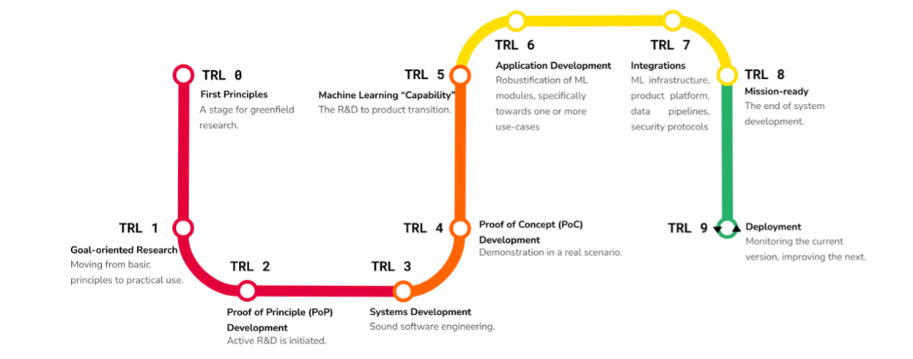
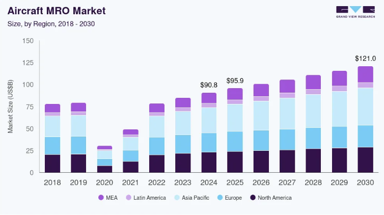
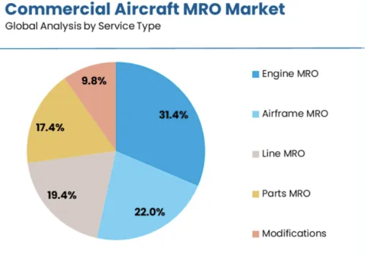
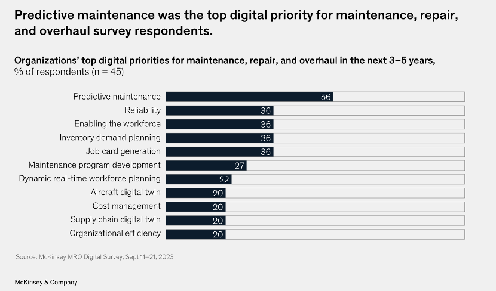
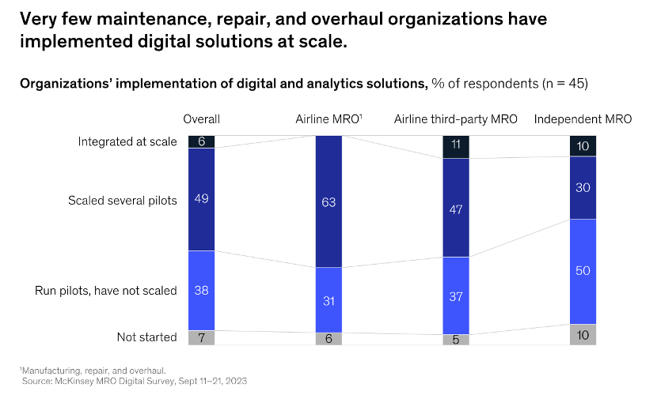
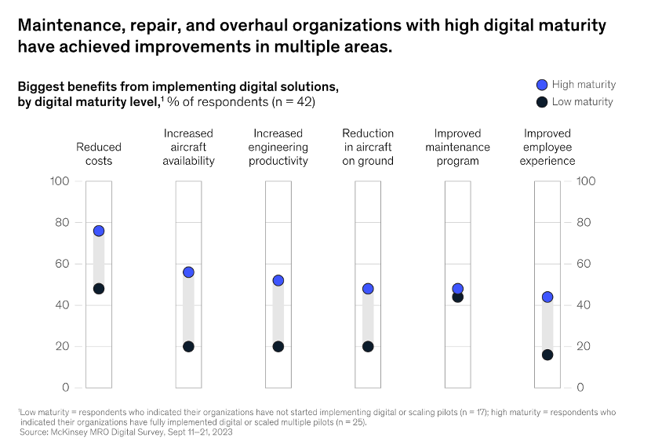

# AirTwin: Market & Competitor Analysis

## Document Status Overview

| Deliverable | Status | Progress | Next Steps |
|------------|--------|----------|------------|
| **Evaluate Business Opportunity** | In Progress (A) | Desk research outline + competitor landscape ongoing; TAM/SAM/SOM to be revised | Master document revision by team for submission |
| **Define Value Proposition** | Drafted (G) | Current market understanding to be refined based on recent findings | Team agreement on core KPIs, metrics & pain-points (AOG %, FC, FH, USP) |
| **Identify Problem & Target Audience** | Drafted (G) | OEMs identified; airlines, engine lessors, ERP/CMMS stacks under consideration (AMOS/ARAMCO) | Deeper research towards conclusive notes and supervisor review |
| **Understand Customer Needs** | In Progress (A) | Draft questionnaire v1.0 available | Questionnaire v2.0 after supervisor review; hypothesis building |
| **Explore Additional Problems** | In Progress (A) | Exploring compliance burden, competitor bottlenecks, ecosystem workflow & supply chain challenges | Research on operational workflow, value-chain, technology trends, market tiers, SWOT analysis, data proprietary considerations |
| **Customer Requirements** | Not Done (R) | Initial understanding and drafts available | Draft v1.0 covering data feeds (ACARS/FOQA/AMOS/Skywise), security, thresholds, report packs, definition of success per buyer type |
| **Market Research Planning** | Ready to Execute (G) | Questionnaire v2.0 in development; 3-5 industry players identified for interviews | Supervisor review, target compilation, GDPR considerations, data capture setup (Hubspot CRM), first wave rollout planning |

---

## 1. Executive Summary

*[To be completed after final revision]*

---

## 2. Technology Overview

### Technology Readiness Level Assessment

To assess the maturity level of the technology, it is essential to consider the Machine Learning Technology Readiness Level (ML-TRL). The framework developed by Lavin et al. (2022)  provides a structured approach for evaluating ML-TRL, offering valuable insights into the readiness level of the AirTwins Project. This is important because traditional TRLs, discussed by NASA  , do not consider the challenges involved in incorporating ML for predictions. AirTwins Project considers dynamic data to make predictions for improved maintenance scheduling.

Figure 1: MLTRL spans research (red) through prototyping (orange), productization (yellow), and deployment (green).

#### Current Assessment Summary

Table 1: TRL summary assessment of AirTwin Project

| Aspect | Assessment |
|--------|------------|
| **Traditional TRL** | NASA/ Aerospace Engineering (Technology Lifecyle) TRL 6 — Demonstrated in relevant environment |
| **ML-TRL Equivalent** | Level 6 — Application development |
| **Maturity Summary** | Prototype validated with real-world data; requires integration, QA, and compliance work for deployment |
| **Next ML-TRL Goal** | Level 7 – Systems integration (integration into production and validation pipelines with customer (eg: airlines) operations and maintenance systems for live testing. Further entering in compliance with aviation standards with continuous data pipeline monitoring and feedback mechanisms |
| **Next Steps** | Business model (Market strategy) and IP strategy; Integration with maintenance systems, Regulatory and compliance assessment, Data governance and continuous monitoring pipeline, |

**Key Finding:** The AirTwin project is at MLTRL Level 6, meaning it is in application development, transitioning from a validated prototype to a deployable system. To reach higher readiness, it must focus on integration testing and operational deployment - core criteria for Levels 7–8 in the MLTRL framework. In order to integrate, the project requires a commercial feasibility report to understand the customer requirements to tune and integrate accordingly.

---

## 3. Market Size & Growth Potential

### Aviation MRO Market Overview

The global aircraft Maintenance, Repair, and Overhaul (MRO) market presents significant opportunity:

- **Global MRO Market:** •	The global aircraft MRO market size was estimated at USD 90.85 billion in 2024 and is projected to reach USD 120.96 billion by 2030, growing at a CAGR of 4.75% from 2025 to 2030 .  
- **U.S. MRO Market:** •	In the U.S. specifically, the MRO market is projected to grow from USD 10.82 billion in 2025 to USD 16.79 billion by 2034 . 
- **Aircraft Engine MRO:** •	The global aircraft engine MRO market size was valued at USD 37.56 billion in 2022 and is projected to grow from USD 42.81 billion in 2023 to USD 59.01 billion by 2030, exhibiting a CAGR of 4.69% during the forecast period .
- **Engine & Component Services:** •	Engine services and component services each contribute about 30% within whole MRO market .

**Key Takeaways:**
1. More aircraft means more maintenance needs.
2. As passenger and cargo demand increases, airlines will require more frequent and comprehensive maintenance services for their fleets

### Predictive Maintenance Market

The predictive maintenance segment shows particularly strong growth:

•	Digital technologies are revolutionizing aircraft MRO processes. The integration of advanced data analytics, artificial intelligence (AI), and machine learning is enabling predictive maintenance, which can reduce downtime and enhance operational efficiency
•	It is the fastest-growing MRO sub-segment, predictive airplane maintenance market valued at USD 5.3 billion in 2024, growing to USD 10.6 billion by 2030, ~13.1 % CAGR .
•	The global predictive maintenance market (across industries) was valued at USD 10.93 billion in 2024, projected to grow significantly (to ~USD 70.73 billion) by 2034 .

**Key Takeaways:**
1) Shows that predictive tools are considered a growth driver in MRO.
2) Indicates stress in the system — an opportunity for efficient predictive systems like AirTwin.
3) Confirms macro momentum in predictive maintenance, which supports investment appetite.

### Key Market Trends

| Trend | Implications |
|-------|-------------|
| **Digital-twin & AI Integration** | Airlines and OEMs use sensor and flight-path data to predict component degradation |
| **Shift to "Power-by-the-Hour" Contracts** | OEMs sell uptime, not parts → predictive tools reduce warranty risk |
| **Data Partnerships** | OEMs, MROs, and tech firms collaborate via cloud platforms |
| **Sustainability Pressure** | Airlines use predictive maintenance to reduce fuel use, CO₂, and waste |

---

## 4. Competitive Landscape

### Major Players & Their Offerings

#### Satavia — DECISIONX Platform

**Type:** Independent tech (Cambridge UK startup)

**Core Offering:** Atmospheric analytics and climate-impact modeling for aviation. The DECISIONX suite (DecisionX NETZERO & DecisionX Contrail) models aircraft-atmosphere interactions to help airlines reduce contrail formation, NOx effects, and environmental exposure.

**Key Customers:** Airbus, Etihad, KLM

**Relevance to AirTwin:** Competes in environmental-exposure modeling, but focuses on climate impact mitigation (contrails/emissions), not maintenance prediction. No confidence-interval or reliability-analytics component.

#### Rolls-Royce — Intelligent Engine

**Type:** OEM

**Core Offering:** Combines digital-twin & PHM (prognostics and health management) using real-time engine data. Twins simulate engine behavior under different operating conditions to improve efficiency, uptime, and safety. Integrated into Power-by-the-Hour contracts.

**Relevance to AirTwin:** Represents highest-TRL benchmark (TRL 9) in engine digital-twin applications. Focused on real-time performance monitoring for RR fleets; proprietary data limits accessibility. AirTwin differs by targeting chemical/ash exposure across fleets beyond RR.

#### Airbus — Skywise Platform

**Type:** OEM (big-data ecosystem powered by Palantir)

**Core Offering:** Unified aviation data platform integrating flight, sensor, maintenance, and operational data for predictive and health monitoring. Enables digital-twin visualization and AI/ML-driven analytics. Connected to >10,000 aircraft and 140+ airlines worldwide.

**Relevance to AirTwin:** Provides advanced fleet-wide predictive maintenance infrastructure but does not model external environmental exposure (chemical, volcanic, particulate). AirTwin could complement Skywise as an add-on for exposure-based risk prediction.

### AirTwin Differentiation

**Key Differentiators:**
- Environmental exposure modeling (chemicals, particulates, volcanic ash)
- Confidence-interval-based predictions
- Clear gap that existing competitors do not emphasize

---
## 3. Detailed Comparison Matrix

### 3.1 Market Tiers & Players

| **Tier** | **Representative Companies** | **Core Offering** | **Revenue Model** | **Maturity** | **Fleet Adoption** | **End-User Impact** |
|----------|----------------------------|-------------------|-------------------|--------------|-------------------|-------------------|
| **OEM Ecosystems** | Airbus Skywise, Boeing Insight Accelerator, RR IntelligentEngine, GE Maintenance Insight | Proprietary digital twins, predictive performance management | Subscription / bundled services | High | ~60% of fleets | High uptime, closed data |
| **Independent Platforms** | Lufthansa AVIATAR, AFI KLM Prognos, ST Eng Smart MRO | OEM-neutral predictive fleet management | SaaS / add-on modules | Medium-High | ~35% | Lower AOG, better scheduling |
| **ERP/CMMS** | AMOS, Ramco Aviation, IFS Maintenix, EmpowerMX, CAMP/Veryon | Work orders, inventory, compliance, planning | Per-aircraft license | High | ~80% | Compliance, cost control |
| **PdM Analytics** | CrossConsense ACSIS, Honeywell Forge, Satavia DECISIONX, Uptake | AI fault prediction, exposure analytics, contrail management | SaaS subscription | Emerging | 20-30% | Downtime ↓ 15-25% |
| **Inspection/Robotics** | Donecle, Mainblades, Waygate Technologies | Drone visual inspection, AI borescope, defect detection | Hardware + SaaS | Early | <10% | TAT ↓ 40%, labor ↓ 25% |
| **Cross-Industry EAM** | IBM Maximo, SAP PAI, Oracle IoT, Siemens MindSphere | Generic PdM for industrial assets | Enterprise license | Mature | Airports/OEMs | Asset uptime |
| **Climate/ESG** | Satavia NETZERO, Atmosfair, Climate X | Contrail avoidance, ESG analytics, carbon credits | SaaS / credit trading | Nascent | <5% | ESG compliance |

---

### 3.2 Detailed Company Profiles

| **Company / Platform** | **Class** | **What They Offer** | **Scale / Clients** | **Integrations** | **Not Their Focus** | **Sources** |
|----------------------|-----------|-------------------|-------------------|------------------|-------------------|-------------|
| **Airbus Skywise** | OEM ecosystem | Data lake, reliability & predictive-maintenance apps, marketplace | ~11,600 connected aircraft (late 2024); 12k+ Airbus supported | Skywise APIs; Digital Alliance (Delta TechOps, GE, Liebherr) | Environmental exposure/corrosion modeling | Airbus newsroom, Aviation Week |
| **Boeing Insight Accelerator** | OEM ecosystem | Flight-data analytics, pattern detection, reliability alerts | Boeing fleet customers | Boeing Global Services stack | Open ecosystem emphasis | Boeing Services documentation |
| **GE Maintenance Insight** | OEM ecosystem | Early fault detection, trends, engine diagnostics | GE-powered fleets; 44k+ engines monitored | GE SaaS + services | Neutral multi-OEM airframe modeling | Reuters, GE Aviation |
| **Rolls-Royce IntelligentEngine** | OEM ecosystem | AI borescope inspection, cloud upload, digital twin | RR-powered fleets; 13k+ engines | Waygate hardware, IFS Maintenix | Airframe-wide PdM, environmental overlays | Rolls-Royce investor reports |
| **Lufthansa Technik AVIATAR** | Independent platform | Condition monitoring, predictive health, reliability workflow | >40 customers, 5,000+ aircraft; LATAM 300+ | Google Cloud-based, rich integrations | Contrail/climate analytics not core | LHT financials, customer announcements |
| **AFI KLM E&M Prognos** | Independent platform | Predictive analytics for components/systems | Airline/MRO customers | OEM/MRO data connectors | Environmental exposure focus | AFI KLM press releases |
| **ST Engineering Smart MRO** | Independent platform | Planning, analytics, smart hangar | Global MRO customers | ST Eng operations stack | Deep PdM across all systems | ST Engineering reports |
| **Swiss-AS AMOS** | ERP/CMMS | Tech records, compliance, inventory, planning | Large global installed base | Many connectors; LHT-owned | Advanced AI PdM emerging | Swiss-AS documentation |
| **Ramco Aviation Suite** | ERP/CMMS | MRO, supply chain, maintenance modules | Airlines/MROs; strong APAC presence | ERP + integrations | Specialized PdM depth | Ramco Systems FY reports |
| **IFS Maintenix** | ERP/CMMS | Maintenance execution, data exchange | Used by RR for engine data sharing | Enterprise suite + APIs | ESG/contrail analytics | IFS case studies |
| **EmpowerMX** | ERP/operations | Line/base MRO execution, scheduling, AI planning | Airlines + DoD programs | API integrations | Domain-deep PdM models | EmpowerMX announcements |
| **CAMP Systems / Veryon** | ERP/CMMS (biz-av) | Health tracking, MTX, EHM | 33k+ engines in EHM; biz-av strength | Integrations in business aviation | Airline-scale PdM scope | CAMP/Veryon materials |
| **CrossConsense ACSIS** | Specialist PdM | Real-time alerts, tech history, troubleshooting | Airline adopters; LHT ecosystem partner | Interfaces with AMOS/others | Environmental exposure/ESG | CrossConsense vendor materials |
| **Honeywell Forge** | Specialist PdM | Performance management, fuel & maintenance analytics | Major carriers | Honeywell ecosystem | Environmental exposure twin | Honeywell Aerospace |
| **Satavia DECISIONX:NETZERO** | Sustainability | Contrail avoidance, atmospheric intelligence, GS concept-approved | Multi-airline trials | APIs to flight planning | Core PdM (maintenance ROI focus) | Gold Standard, Satavia announcements |
| **Donecle / Mainblades / Waygate** | Inspection/robotics | Drone visual inspection, borescope, AI defect detection | 20+ airlines, OEM programs | Data feeds to PdM/ERP | Predictive modeling | Vendor documentation |

---

### 3.3 Capability Matrix vs. Market Needs

| **Capability** | Skywise | Insight Accel. | RR Intelligent | GE Maint. | AVIATAR | AMOS/Ramco/IFS | ACSIS | Forge | Satavia | Drones | **AirTwin** | **Market Need** |
|----------------|---------|---------------|----------------|-----------|---------|----------------|-------|-------|---------|--------|-------------|----------------|
| **Health Monitoring (systems)** | ✔️ | ✔️ | ✔️ (engine) | ✔️ (engine) | ✔️ | ⚪ | ✔️ | ✔️ | ⚪ | ⚪ | ✔️ | **HIGH** |
| **Predictive Maintenance (AI/ML)** | ✔️ (black-box) | ✔️ | ✔️ (engine) | ✔️ (engine) | ✔️ | ⚪ | ✔️ | ✔️ | ⚪ | ❌ | ✔️ | **CRITICAL** |
| **Environmental Exposure Twin** | ❌ | ❌ | ❌ | ❌ | ❌ | ❌ | ❌ | ❌ | ⚪ (contrails) | ❌ | **✔️ (UNIQUE)** | **EMERGING** |
| **Prescriptive Workcards** | ⚪ | ⚪ | ⚪ | ⚪ | ⚪ | ⚪ | ⚪ | ⚪ | ❌ | ❌ | **✔️** | **MEDIUM** |
| **Physics-Based Digital Twin** | ⚪ | ⚪ | ✔️ (engine) | ✔️ (engine) | ⚪ | ❌ | ⚪ | ✔️ | ❌ | ❌ | **✔️** | **HIGH** |
| **Material Degradation Modeling** | ❌ | ❌ | ⚪ (engine) | ⚪ (engine) | ❌ | ❌ | ❌ | ⚪ | ❌ | ❌ | **✔️** | **MEDIUM** |
| **Confidence Interval Predictions** | ⚪ | ⚪ | ⚪ | ⚪ | ⚪ | ⚪ | ⚪ | ⚪ | ⚪ | ❌ | **✔️** | **MEDIUM** |
| **Open Ecosystem / Neutral** | ⚪ | ❌ | ❌ | ❌ | ✔️ | ✔️ | ✔️ | ⚪ | ✔️ | ✔️ | **✔️** | **HIGH** |
| **ESG / Contrail Overlay** | ❌ | ❌ | ❌ | ❌ | ❌ | ❌ | ❌ | ❌ | ✔️ | ❌ | ⚪ | **GROWING** |
| **Fleet-Wide Analytics** | ✔️ | ✔️ | ✔️ | ✔️ | ✔️ | ✔️ | ✔️ | ⚪ | ⚪ | ❌ | ⚪ | **HIGH** |
| **Tail-Specific Tracking** | ✔️ | ✔️ | ✔️ | ✔️ | ✔️ | ✔️ | ✔️ | ✔️ | ⚪ | ❌ | **✔️** | **CRITICAL** |
| **Explainable AI / Physics Hybrid** | ❌ | ❌ | ⚪ | ⚪ | ❌ | ❌ | ❌ | ⚪ | ❌ | ❌ | **✔️ (UNIQUE)** | **EMERGING** |
| **MRO Integration** | ✔️ | ⚪ | ⚪ | ⚪ | ✔️ | ✔️ | ✔️ | ⚪ | ❌ | ❌ | ⚪ | **HIGH** |

**Legend:**
- ✔️ = Core capability with strong market presence
- ⚪ = Partial capability or not emphasized publicly
- ❌ = Not a focus area based on public documentation

**Gap Analysis**: Environmental exposure modeling (salt/particulate/humidity) and prescriptive maintenance workcards represent underserved market segments with high growth potential.

**AirTwin differentiation** uses environmental exposure modelling (chemicals, particulates, volcanic ash) and provides confidence-interval-based predictions — a clear gap none of the above emphasise

## 5. Business Model Comparison: Satavia vs. AirTwin

| Block | Satavia | AirTwin (Hypothesis) |
|-------|---------|----------------------|
| 1. Customer Segments | Paying customers include airlines; Etihad Airways signed a multi-year commercial production contract to use contrail management in routine operations. [Etihad Global)] | • Airlines (fleet maintenance & operations teams) • Engine OEMs (e.g. Rolls-Royce) • Independent MRO providers • Aircraft lessors & insurers (asset/risk management) |
| 2. Value Proposition | Route optimisation to reduce formation of persistent warming contrails and quantified avoided climate impact measured as carbon dioxide equivalent. A ten-month programme on sixty-five flights operated by twelve airlines reported more than 2,200 tonnes of carbon dioxide equivalent avoided in total and more than forty tonnes per flight on average, with minimal impact on fuel consumption or flight distance. - Airlines participating in the trials included Icelandair, Kenya Airways, Condor, and SunExpress. [(GreenAir News)] | • Reduces unplanned downtime and maintenance costs. • Provides confidence-driven predictive analytics (unique vs competitors). • Quantifies chemical & particulate exposure to improve safety and sustainability. |
| 3. Channels | Enterprise software distribution and discoverability via Microsoft AppSource listing for SATAVIA's DECISIONX offering - Microsoft (AppSource listing).  (Appsource – Business Apps) | • Direct SaaS platform subscription. • Integration via OEM or MRO digital platforms. • Partner distribution through aviation software vendors. |
| 4. Customer Relationships | Ongoing operational use through a multi-year commercial production agreement, indicating day-to-day support and service beyond pilots - Etihad Airways | • Pilot projects and co-development with early adopters. • Dedicated technical support & analytics dashboard. • Data-sharing agreements with enterprise partners. |
| 5. Revenue Streams | Current: Enterprise software and service fees associated with routine contrail management operations (pricing not publicly disclosed) - Etihad Airways contract confirms paid commercial deployment. [(Etihad Global)]  Prospective: Potential future revenues linked to climate crediting: Gold Standard approved the contrail methodology concept and ran a public consultation on a proposed methodology to issue Certified Mitigation Outcome Units for contrail prevention. This is contingent on final methodology and issuance. [(GreenAir News)] | • Subscription model (per engine / per flight hour). • Consulting and model calibration services. • OEM licensing or white-label integration fees. |
| 6. Key Resources | Atmospheric modelling and the DECISIONX platform operate on cloud infrastructure; Microsoft reported SATAVIA modelling the Earth's atmosphere on Microsoft Azure. (Microsoft UK Stories) | • Data science & atmospheric modelling team. • Environmental datasets (e.g., ECMWF, satellite data). • Cloud computing & digital twin infrastructure. • Aviation domain expertise & partnerships. |
| 7. Key Activities | Forecasting contrail-forming atmospheric conditions and pre-flight route optimisation; reporting of avoided climate impact from operational trials; methodology development with Gold Standard. (GreenAir News) | • Data collection, model calibration, and validation. • Software platform development. • Customer onboarding, pilots, and result demonstration. |
| 8. Key Partnerships | Market infrastructure partnership to enable trading of credits arising from non-carbon-dioxide impacts; collaboration on atmospheric forecasting for contrail flight tests; public-sector co-funding of airline trials. [(acx.net)] | • Airlines & OEMs for data access and validation. • Environmental data providers. • Regulatory bodies for compliance alignment. |
| 9. Cost Structure | Trial reporting states "minimal impact" on fuel consumption and distances when implementing contrail management; any additional fuel is borne by airlines. SATAVIA's own cost breakdown is not publicly itemised. [(GreenAir News)] | • Cloud computing and data licensing fees. • Model development and maintenance costs. • Business development and pilot projects. |
---

## 6. Customer Research Framework

### Target Customer Priority Matrix

**Early Targets:** Airlines and Lessors (high influence, high pain-point accessibility)

**Strategic Partnerships:** Engine OEMs (critical for integration and data access)

**Secondary Market:** Independent MROs (mid-term opportunity once value is proven)

**Long-term Potential:** Insurers and Regulators (adoption through compliance and risk-management incentives)

### Target Respondent Groups

| Group | Rationale | Example Roles |
|-------|-----------|---------------|
| **Airlines (Operators)** | Primary users facing direct costs of unplanned maintenance and delays | Maintenance Engineer, Fleet Manager, Operations Director, Sustainability Lead |
| **Engine OEMs** | Hold performance and warranty data; potential integration partners | Technical Program Manager, Digital Innovation Lead |
| **MROs (Independent)** | Perform scheduled and unscheduled repairs; benefit from exposure-based planning | Maintenance Planner, Workshop Manager |
| **Aircraft Lessors** | Concerned about residual value, component life, and asset performance | Asset Manager, Technical Services Lead |
| **Insurers/Regulators** | Influence industry standards and incentives for risk reduction | Risk Analyst, Aviation Safety Officer |

**Target:** 10-15 total responses, prioritizing Airlines and MROs for early validation for early validation (as they are easier to access and highly relevant).

---

## 7. Questionnaire Development

### Version 2.0: Evidence-Based Validation Framework

The questionnaire is designed to validate critical business model assumptions and identify gaps versus existing competition.

#### Validation Themes & Required Evidence

| Theme | Current Gap | What to Validate | Evidence to Collect |
|-------|-------------|------------------|---------------------|
| **Primary Paying Customer** | No confirmed buyer with budget authority | Identify single buyer role that signs and funds pilot | Buyer role, budget owner, procurement path, timeline |
| **Single Operational Use Case** | Scope diffuse across exposure types | Select one exposure problem tied to daily maintenance decision | Written problem statement, decision trigger, success condition |
| **Data Access & Lawful Basis** | Required datasets and permissions unconfirmed | Fields, ownership, access path, retention, lawful basis | Data inventory, governance approvals, draft data-sharing agreement |
| **Workflow Integration** | No agreed system or process endpoint | Where AirTwin lives (system of record) and required interfaces | Target systems list, interface specs, named technical owner |
| **Accuracy & Confidence Thresholds** | Actionable performance thresholds undefined | Minimum detection rate, maximum false alerts, minimum lead time | Metric definitions, validation protocol, historical benchmarks |
| **Economic Value & Payback** | Savings versus costs unquantified | Unit economics per customer type using real inputs | Event rates, AOG costs, parts costs, calculated savings model |
| **Pricing Model & Corridor** | No accepted commercial structure or range | Preferred pricing model and acceptable price corridor | Model preference data, indicative ranges, letters of intent |
| **Pilot Design & Success Metrics** | Pilot scope and pass/fail gates unclear | Standard pilot scope, duration, aircraft count, datasets, outcome metrics | Pilot charter, timeline, metric targets, stakeholder sign-offs |
| **Anchor Partnerships** | Critical partners and incentives unspecified | Required partners and value exchange | Partner map, roles and responsibilities, commitment letters |
| **Differentiation vs. Incumbent Tools** | Overlap with existing tools untested | Unique gap closed versus current platforms | Comparative capability matrix, buyer confirmations of unmet need |

### Core Question Themes

#### A. Current Maintenance Practice
- How frequently does your organization perform scheduled engine maintenance?
- What are the main causes of unplanned maintenance or flight delays?
- How is environmental exposure (dust, chemicals, volcanic ash) currently monitored or recorded?

#### B. Pain Points & Costs
- How significant are maintenance-related costs or downtime for your operations? (1-5 scale)
- Which area contributes most to cost uncertainty: engine, components, or external exposure?
- Have you experienced reliability issues linked to weather or environmental conditions?

#### C. Awareness & Technology Adoption
- Are you familiar with digital-twin or predictive-maintenance technologies?
- Does your organization currently use predictive-analytics tools (e.g., Skywise, Rolls-Royce Intelligent Engine)?
- What are the biggest barriers to adoption? (cost, data-sharing, integration, regulatory constraints)

#### D. Perceived Value of AirTwin-Like Solution
- How valuable would confidence-based predictions (with uncertainty ranges) be for exposure-related maintenance?
- Which outcomes matter most: reduced downtime, cost predictability, safety improvement, or sustainability reporting?
- Would you be interested in piloting a solution that quantifies exposure-related degradation?

#### E. Business & Implementation Feasibility
- How do you prefer to purchase predictive tools: subscription (SaaS), pay-per-engine, or bundled via OEM partnership?
- What is a reasonable payback period for adopting a new maintenance-analytics solution?
- Who in your organization makes the final decision to adopt such tools?

#### F. Demographics (Optional)
- Organization name and size (fleet size/employee count)
- Region of operation
- Job title/role

**Questionnaire Length:** 15-18 questions (10-12 core + 3-5 optional)

---

## 8. Next Steps

### Immediate Priorities
1. Complete questionnaire v2.0 refinement with supervisor
2. Identify and compile target respondent list (10-15 contacts)
3. Address GDPR considerations and set up data capture (Hubspot CRM)
4. Schedule initial interviews with 3-5 top industry players
5. Develop first-wave rollout strategy

### Medium-Term Goals
1. Conduct customer validation interviews
2. Refine business model based on feedback
3. Develop detailed pilot program charter
4. Establish anchor partnerships with key OEMs or airlines
5. Quantify unit economics with real customer data

### Long-Term Objectives
1. Achieve ML-TRL Level 7 (systems integration)
2. Secure first commercial pilot deployment
3. Develop regulatory compliance pathway
4. Build continuous data pipeline and monitoring infrastructure
5. Scale customer base across target segments

---

## Appendix A: ML-TRL Level Details

| ML-TRL Level | Description | AirTwin Status | Justification |
|--------------|-------------|----------------|---------------|
| **TRL 0** | Basic principles observed | ✓ Completed | NCAS atmospheric modeling established theoretical underpinnings |
| **TRL 1** | Goal-oriented research concept | ✓ Completed | AirTwin concept formulated for aircraft engine exposure and maintenance forecasting |
| **TRL 2** | Proof of principle | ✓ Completed | Digital twin validated on simulated atmospheric data and regional weather models |
| **TRL 3** | Experimental proof of concept | ✓ Completed | Demonstrated predictive modeling using flight and atmospheric data |
| **TRL 4** | Prototype validated in lab | ✓ Completed | Working digital twin pipeline established in research environment (University of Cambridge/NCAS) |
| **TRL 5** | Technology validated in relevant environment | ✓ Completed | Validated using actual research flight and atmospheric data |
| **TRL 6** | Application development | **→ Current Stage** | Technology demonstrated on research aircraft; not yet deployed commercially. Further development needed for scalability, compliance, and customer integration |
| **TRL 7** | System prototype in operational environment | ○ Not Yet Achieved | No integration with commercial airline platforms or predictive maintenance systems |
| **TRL 8** | System completed and qualified | ○ Not Yet Achieved | Needs compliance validation, continuous data pipeline, and operational governance |
| **TRL 9** | System proven through successful operations | ○ Not Yet Achieved | No production deployment or operational monitoring yet |

---

## Appendix B: Satavia Revenue Structure Evidence

| Item | Description | Revenue/Cost | Evidence Source | URL | Notes |
|------|-------------|--------------|-----------------|-----|-------|
| **B2B Software (DECISIONX:NETZERO)** | Airlines use platform for contrail avoidance | Recurring commercial fees | Etihad multi-year commercial agreement | [Link](https://www.etihad.com/en-us/news/etihad-and-satavia-sign-multi-year-commercial-agreement) | Confirms paid, day-to-day deployment |
| **Credit-Linked Revenues (CMOUs)** | Monetizing avoided warming via Gold Standard | Potential revenue share | Gold Standard consultation on contrail prevention | [Link](https://www.goldstandard.org/consultations/contrail-prevention) | Explains CO₂e conversion and CMOUs |
| **Trading Enablement** | Partnership with AirCarbon Exchange | Indirect monetization | SATAVIA-ACX partnership announcement | [Link](https://acx.net/media-release/satavia-partners-with-aircarbon-exchange) | Enables CMOU transactions |
| **Grants & Funding** | ESA/UKSA support for trials | Grant/contract income | ESA Business Applications news | [Link](https://business.esa.int/news/uk-based-startup-develops-new-technology) | Non-recurring R&D support |
| **Customer Value: Avoided Warming** | Quantified climate benefit | >40 tCO₂e avoided per flight | Trial results from 12 airlines | [Link](https://www.greenairnews.com/?p=5578) | >2,200 tCO₂e total; minimal ops impact |

---

## References

1. Lavin, A., et al. (2022). Technology readiness levels for machine learning systems. *Nature Communications*, 13(1), 6039.
2. NASA Technology Readiness Levels: https://www.nasa.gov/directorates/somd/space-communications-navigation-program/technology-readiness-levels/
3.   Grand View Research (2024). Aircraft MRO Market Size Report. https://www.grandviewresearch.com/industry-analysis/aircraft-mro-market
4.   Market Research Future (2025). US Aircraft Maintenance, Repair and Overhaul Market Report - https://www.marketresearchfuture.com/reports/us-aircraft-maintenance-repair-and-overhaul-market-21422
5.   Fortune Business Insights (2023). Aircraft Engine MRO Market Report - https://www.fortunebusinessinsights.com/aircraft-engine-mro-market-108858
6.   Future Market Insights. Commercial Aircraft MRO Market Analysis. - https://www.futuremarketinsights.com/reports/commercial-aircraft-mro-market

7.  Strategic Market Research. Aircraft MRO Market Report - https://www.strategicmarketresearch.com/market-report/aircraft-mro-market
8.   GM Insights. Predictive Airplane Maintenance Market Report - https://www.gminsights.com/industry-analysis/predictive-airplane-maintenance-market
9.  Fortune Business Insights (2024). Predictive Maintenance Market Report - https://www.fortunebusinessinsights.com/predictive-maintenance-market-102104
10. https://www.mckinsey.com/industries/travel/our-insights/aircraft-mro-2-point-0-the-digital-revolution
11. https://www.aerospacecarbonsolutions.com/contrail-management
12. https://www.rolls-royce.com/media/our-stories/discover/2019/how-digital-twin-technology-can-enhance-aviation.aspx
13. https://papers.phmsociety.org/index.php/phmap/article/view/3722

14. McKinsey & Company. Aircraft MRO 2.0: The Digital Revolution.
15. Satavia DECISIONX Platform: https://www.aerospacecarbonsolutions.com/contrail-management
16. Rolls-Royce Intelligent Engine: https://www.rolls-royce.com/media/our-stories/discover/2019/how-digital-twin-technology-can-enhance-aviation.aspx
17. Airbus Skywise Platform: https://papers.phmsociety.org/index.php/phmap/article/view/3722

---

*Document Version: Draft for Review*  
*Last Updated: October 2025*  
*Status: Awaiting supervisor feedback and questionnaire v2.0 finalization*
