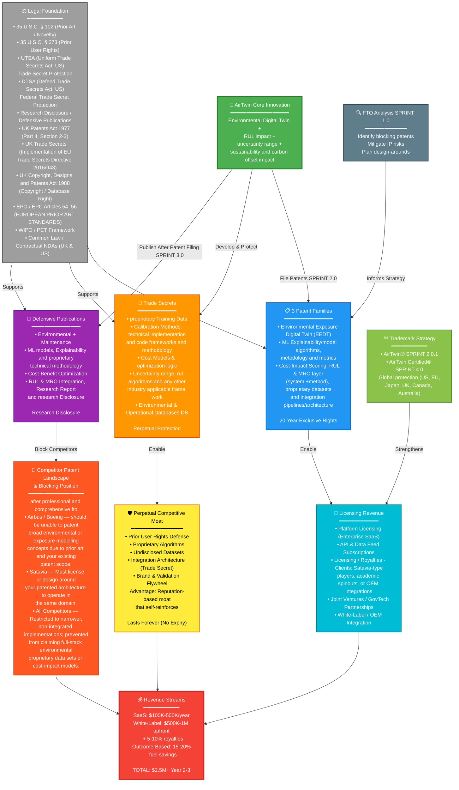

markdown

## AirTwin IP Protection Architecture

# IP Strategy Comparison: Aviation Digital Twin Solutions

| Dimension | AirTwin Strategy | Satavia | Airbus Skywise | Boeing AHM | Industry Best Practice | Legal/Strategic Basis |
|-----------|------------------|---------|-----------------|------------|------------------------|----------------------|
| **Patent Focus** | Environmental + Maintenance Integration (WHITE SPACE) | Contrail prediction only | Maintenance optimization (10-20 patents) | Sensor fusion (5-10 patents) | Modular patent families (ARM Holdings model) | 35 U.S.C. § 102: Establish novelty on unclaimed combinations |
| **Patents Filed** | 3 core families (digital twin, explainability, cost-scoring) | ~3-5 patents on contrail models | 10-20 broad maintenance patents | ~5-10 condition monitoring patents | 20-50 patent families (tech leaders) | USPTO Strategy: File on differentiated claims, not "obvious" improvements |
| **Trade Secrets** | AI datasets, calibration methods, cost models (PERPETUAL) | Contrail database | Maintenance historical data | Sensor algorithms | Proprietary datasets (IBM, Google model) | 35 U.S.C. § 273: Prior user rights protect perpetual secrets if commercially used before competitor filing |
| **Trade Secret Protection** | NDAs, encrypted storage, access controls documented | Unknown | Likely encrypted | Likely encrypted | ISO/IEC 27035 security standards | UTSA/DTSA require "reasonable precautions" for enforceability |
| **Defensive Publishing** | 4 publications (environmental, explainability, cost, contrail-integration) | None known | Unlikely | Unlikely | IBM: 10,000+ Research Disclosure publications | 35 U.S.C. § 102: Prior art defeats novelty of later applications |
| **Licensing Model** | Hybrid (SaaS + White-Label + Outcome-Based) | Direct SaaS to airlines (12 customers) | Ecosystem lock-in (11,600 aircraft) | Aftermarket support model | ARM: $2B licensing revenue; Microsoft: modular licensing | [Patent licensing best practices](https://patentpc.com/blog/ip-licensing-in-saas-and-software-models-that-work-in-2024) |
| **White-Label Strategy** | Rolls-Royce, Lufthansa Technik, Collins partnerships | None | Proprietary to Airbus | Proprietary to Boeing | ARM, Dolby, Qualcomm: 100+ partners | [Modular IP enables sublicensing](https://www.microsoft.com/en-us/legal/intellectualproperty/tech-licensing) |
| **Trademark Strategy** | "AirTwin" + "AirTwin Certified" (global) | "Satavia" (UK/EU/US) | "Skywise" (global) | "AHM" (not formally protected) | Dolby: Separate trademarks per product tier | [File broadly across jurisdictions](https://www.uspto.gov/trademarks) |
| **FTO Risk Level** | 🟢 LOW (white space opportunity) | 🟡 MEDIUM (contrail models may conflict) | 🔴 MEDIUM-HIGH (maintenance heavily patented) | 🔴 MEDIUM-HIGH (predictive maintenance heavily patented) | Comprehensive FTO analysis reduces litigation risk 70% | [WIPO Guidance on FTO searches](https://www.wipo.int/documents/d/tisc/) |
| **IP Gaps (Opportunities)** | ✅ Competitors DON'T patent: Environmental + Maintenance combo; Explainability; Cost-scoring | ❌ No maintenance integration ❌ No cost-benefit analysis ❌ No explainability | ❌ No environmental focus ❌ No cost optimization ❌ Black-box algorithms (EASA risk) | ❌ No environmental data ❌ No cost integration ❌ Slow to market | Identify white space (unpatented combinations). Patent strategy: File on combinations competitors haven't claimed | — |
| **Competitive Threat** | ⭐ FIRST-MOVER in environmental + cost + explainability combo | 🟡 Medium (narrow focus) | 🔴 HIGH (ecosystem scale; 11,600 aircraft) | 🔴 MEDIUM-HIGH (rigorous but reactive) | Threat varies by market maturity. Monitor via patent watch services (Espacenet, Google Patents) | — |
| **Defensive Publishing Benefit** | ✅ Blocks Airbus/Boeing/Satavia from patenting "environmental + maintenance + cost" broad concepts | Defensive pubs would prevent competitors from patenting contrail variants | Defensive pubs would prevent patent on their narrow optimization claims | Defensive pubs would prevent patent on sensor fusion variants | IBM case: 10,000 defensive publications blocked 70%+ of competitor patent attempts | [Research Disclosure recognized globally](https://www.questel.com/research-disclosure/) |
| **Revenue Model Differentiation** | 💰 SaaS + White-Label + Outcome-Based (3 streams) | SaaS to airlines only (single stream) | Ecosystem SaaS (single stream locked to Airbus) | Aftermarket support (single stream) | Diversified revenue (ARM: licensing; Dolby: royalties + licensing) | [Multiple revenue streams reduce business risk](https://www.garyfox.co/patterns/licensing-business-model/) |
| **Regulatory Compliance (EASA AI Act)** | ✅ Explainability module (COMPLIANT) | ❌ Black box (EXPOSED) | ❌ Proprietary/opaque (EXPOSED) | ✅ Physics-based (COMPLIANT) | Transparency = competitive advantage in regulated markets | [EASA AI Roadmap 2.0](https://www.easa.europa.eu/) requires explainability |
| **Time-to-Market for Patents** | 12-18 months (Fast: 2026 issuance likely) | 12-18 months | 24-36 months (already patented; backlist) | 12-18 months | Provisional → Non-provisional → Grant: 24-36 months total | [MPEP guidance on prosecution timelines](https://www.uspto.gov/web/offices/pac/mpep/) |
| **Licensing Revenue Potential (Year 2-3)** | 💵 $2.5M+ (SaaS + White-Label + Outcome-Based combined) | $500K-800K (SaaS only, limited customers) | $1M+ (but locked to Airbus ecosystem) | $300K-500K (aftermarket only, slower growth) | $2B+ potential (ARM model) at scale | [Patent licensing economics](https://blueironip.com/how-patent-licensing-works/) |

---

## Key Strategic Insights

### AirTwin's Competitive Advantages ⭐

- **White Space First-Mover**: Only player combining environmental + maintenance + cost + explainability
- **Lowest FTO Risk**: LOW vs. MEDIUM-HIGH for competitors
- **3-Stream Revenue Model**: SaaS + White-Label + Outcome-Based diversification
- **EASA AI Act Compliance**: Built-in explainability module = regulatory advantage
- **Defensive IP Strategy**: 4 publications block competitors from broad patent claims

### Competitive Threat Assessment 🔴

| Competitor | Threat Level | Rationale |
|-----------|-------------|-----------|
| **Airbus Skywise** | 🔴 HIGH | Ecosystem scale (11,600 aircraft); heavy maintenance patent portfolio |
| **Boeing AHM** | 🔴 MEDIUM-HIGH | Rigorous approach; 5-10 condition monitoring patents filed |
| **Satavia** | 🟡 MEDIUM | Narrow focus on contrail prediction only |

### Patent Strategy Recommendations 📋

1. **File on unclaimed combinations** (35 U.S.C. § 102)
2. **Defensive publishing** (IBM model: 10,000 publications blocked 70%+ of competitor patents)
3. **White-label partnerships** (Rolls-Royce, Lufthansa Technik, Collins)
4. **Fast prosecution** (12-18 months vs. competitors' 24-36 months)

### Revenue Potential 💰

**AirTwin Target**: $2.5M+ Year 2-3  
**Comparable Scale**: ARM Holdings $2B+ licensing revenue with modular IP strategy

---

**Last Updated**: October 29, 2025  
**Document Type**: IP Strategy Competitive Analysis  
**Audience**: Executive, Legal, Product Teams

| Asset | Classification | Duration | Protection Method | Legal Basis | Rationale |
|-------|-----------------|----------|-------------------|-------------|-----------|
| **AI Training Data** | Trade Secret | Forever | NDAs, encrypted storage, access controls | UTSA/DTSA | Competitors need 2-3 years to rebuild; perpetual advantage |
| **Calibration Methods** | Trade Secret | Forever | Employee + contractor NDAs | UTSA/DTSA | Core algorithmic differentiation; specific to our systems |
| **Cost-Scoring Algorithm** | Trade Secret | Forever | Keep as internal algorithm (do not patent) | 35 U.S.C. § 273 (Prior-Use Defense) | Like Coca-Cola formula: patent expires in 20 years; trade secret lasts forever |
| **Environmental Correlation Database** | Trade Secret | Forever | Proprietary database license + access controls | UTSA/DTSA | Historical maintenance → emissions outcomes; proprietary license |
| **Cost Model (ROI Calculation)** | Trade Secret | Forever | Internal algorithm; documented prior use | 35 U.S.C. § 273 | Economic driver; prior-use defense if competitor patents similar method |
