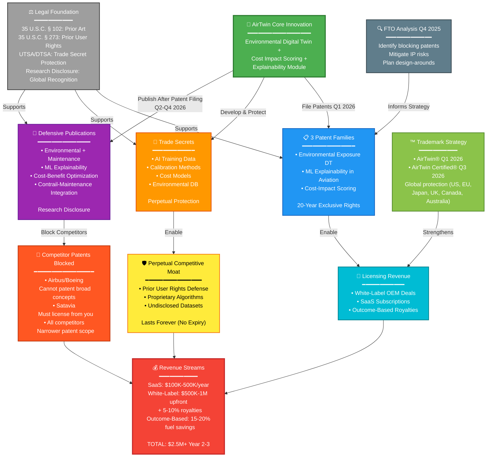

markdown

## AirTwin IP Protection Architecture

```mermaid

graph TB
    A["🎯 AirTwin Core Innovation<br/>━━━━━━━━━━━━━━━━━━<br/>Environmental Digital Twin +<br/>Cost Impact Scoring +<br/>Explainability Module"] 
    
    A -->|File Patents Q1 2026| B["📋 3 Patent Families<br/>━━━━━━━━━━━━━━━<br/>• Environmental Exposure DT<br/>• ML Explainability in Aviation<br/>• Cost-Impact Scoring<br/><br/>20-Year Exclusive Rights"]
    
    A -->|Develop & Protect| C["🔐 Trade Secrets<br/>━━━━━━━━━━━━<br/>• AI Training Data<br/>• Calibration Methods<br/>• Cost Models<br/>• Environmental DB<br/><br/>Perpetual Protection"]
    
    A -->|Publish After Patent Filing<br/>Q2-Q4 2026| D["📢 Defensive Publications<br/>━━━━━━━━━━━━━━━<br/>• Environmental + Maintenance<br/>• ML Explainability<br/>• Cost-Benefit Optimization<br/>• Contrail-Maintenance Integration<br/><br/>Research Disclosure"]
    
    B -->|Enable| E["💼 Licensing Revenue<br/>━━━━━━━━━━━━<br/>• White-Label OEM Deals<br/>• SaaS Subscriptions<br/>• Outcome-Based Royalties"]
    
    C -->|Enable| F["🛡️ Perpetual Competitive Moat<br/>━━━━━━━━━━━━━━━━<br/>• Prior User Rights Defense<br/>• Proprietary Algorithms<br/>• Undisclosed Datasets<br/><br/>Lasts Forever (No Expiry)"]
    
    D -->|Block Competitors| G["🚫 Competitor Patents Blocked<br/>━━━━━━━━━━━━━━━━━<br/>• Airbus/Boeing<br/>  Cannot patent broad concepts<br/>• Satavia<br/>  Must license from you<br/>• All competitors<br/>  Narrower patent scope"]
    
    E --> H["💰 Revenue Streams<br/>━━━━━━━━━━━<br/>SaaS: $100K-500K/year<br/>White-Label: $500K-1M upfront<br/>  + 5-10% royalties<br/>Outcome-Based: 15-20%<br/>  fuel savings<br/><br/>TOTAL: $2.5M+ Year 2-3"]
    
    F --> H
    
    G --> H
    
    I["🔍 FTO Analysis Q4 2025<br/>━━━━━━━━━━━━━<br/>Identify blocking patents<br/>Mitigate IP risks<br/>Plan design-arounds"]
    
    I -->|Informs Strategy| B
    
    J["™️ Trademark Strategy<br/>━━━━━━━━━━━<br/>• AirTwin® Q1 2026<br/>• AirTwin Certified® Q3 2026<br/>Global protection (US, EU,<br/>Japan, UK, Canada, Australia)"]
    
    J -->|Strengthens| E
    
    K["⚖️ Legal Foundation<br/>━━━━━━━━━━━<br/>35 U.S.C. § 102: Prior Art<br/>35 U.S.C. § 273: Prior User Rights<br/>UTSA/DTSA: Trade Secret Protection<br/>Research Disclosure: Global Recognition"]
    
    K -->|Supports| B
    K -->|Supports| C
    K -->|Supports| D
    
    style A fill:#4CAF50,stroke:#2E7D32,color:#fff,stroke-width:3px
    style B fill:#2196F3,stroke:#1565C0,color:#fff,stroke-width:2px
    style C fill:#FF9800,stroke:#E65100,color:#fff,stroke-width:2px
    style D fill:#9C27B0,stroke:#6A1B9A,color:#fff,stroke-width:2px
    style H fill:#F44336,stroke:#C62828,color:#fff,stroke-width:3px
    style E fill:#00BCD4,stroke:#00838F,color:#fff,stroke-width:2px
    style F fill:#FFEB3B,stroke:#F57F17,color:#000,stroke-width:2px
    style G fill:#FF5722,stroke:#BF360C,color:#fff,stroke-width:2px
    style I fill:#607D8B,stroke:#37474F,color:#fff,stroke-width:2px
    style J fill:#8BC34A,stroke:#558B2F,color:#fff,stroke-width:2px
    style K fill:#9E9E9E,stroke:#424242,color:#fff,stroke-width:2px

```
